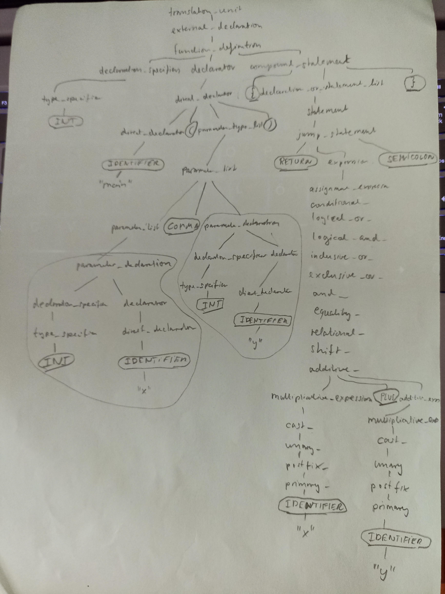
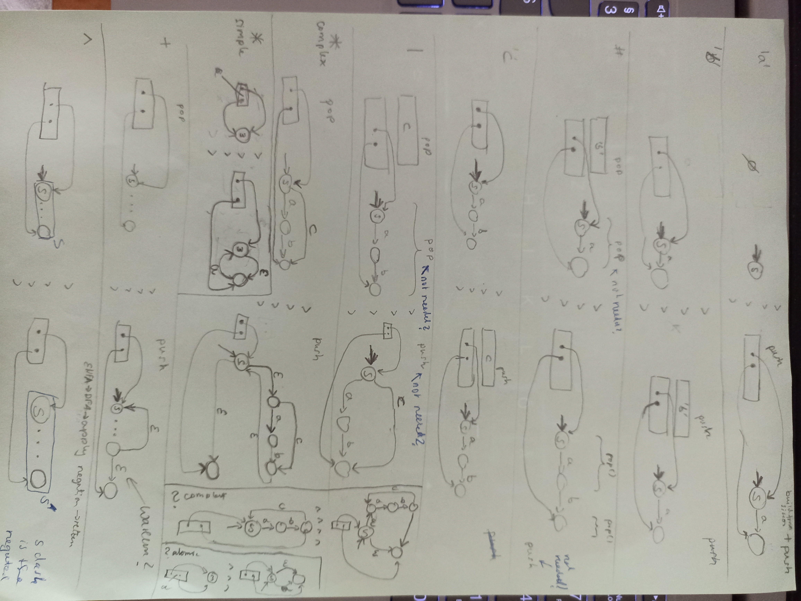
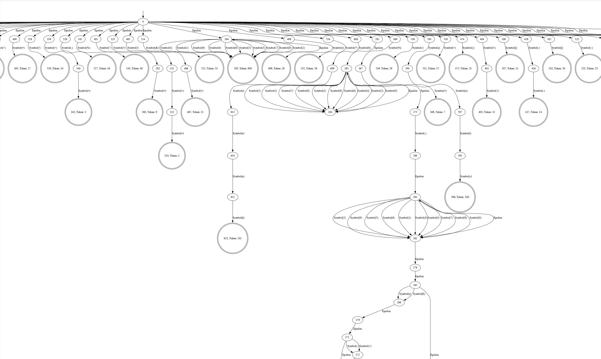
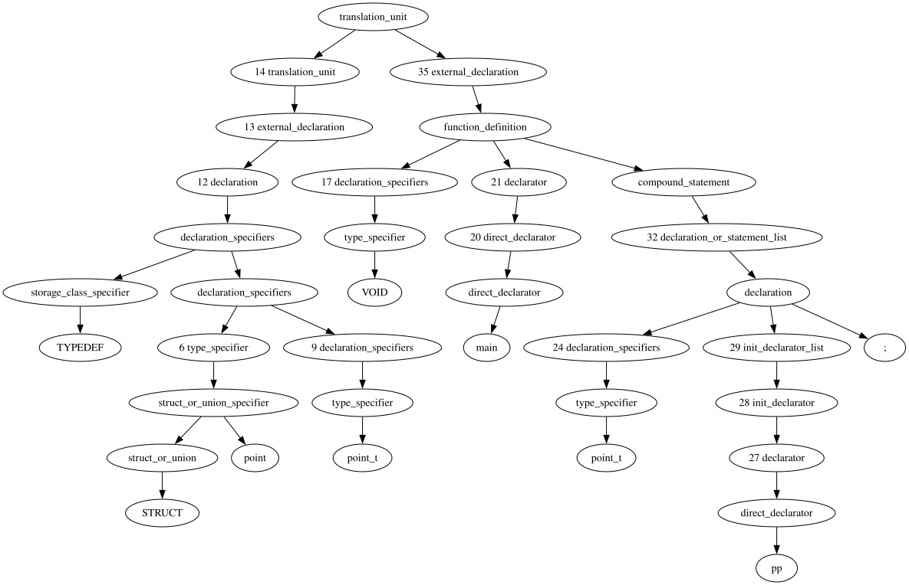
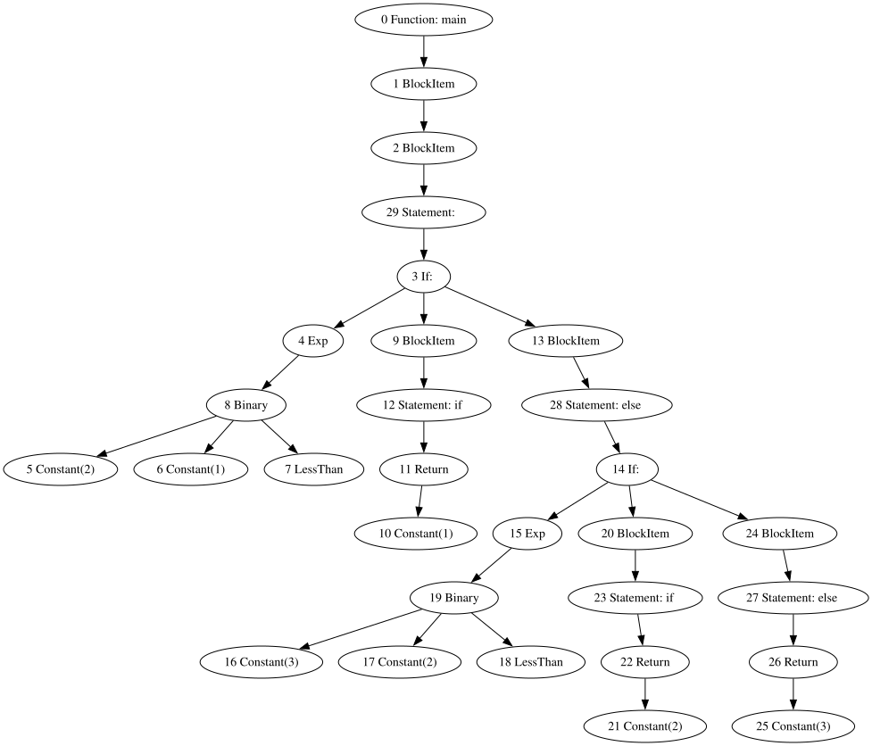

# C Compiler build according to Nora Sandler's Book - Writing a C Compiler

This is a C compiler written in Rust for the C programming language.

## Assembler

Good Overview of x86 and also x86-64 bit: https://en.wikibooks.org/wiki/X86_Assembly/Print_Version

To assemble the output, you may use MASM from within Visual Studio.

[MASM](MASM.md)

# Disclaimer

```
Roses are red, violets are blue... Unexpected ‘{‘ on line 32.
```

I am not an expert compiler designer! Read with caution!
Also excuse the horrible drawings! I am not a graphics designer by any means! I just do not know how to generate nice digital images. Having analog drawings is better than nothing.

Other than that. I hope you like this document. Thanks for reading. Enjoy.

If you do not know about automata, please first consult the internet or the analog computer science literature. There is plenty of information out there. Automata are the formal theoretical basis of lexing and parsing. Same goes for context free grammars. 

And the LALR(1) parser used in this document is generally outdated (but works for the grammar used). Maybe you want to look into other types of parsers.

# The preprocessor

Many tests:

https://github.com/Thewbi/cpp_compiler/tree/main/src/test/resources/preprocessor

Removes comments (single line // and multiline comments are removed /* */ and replaced by a single space character).
Comments are not part of the C-grammar! This means the C-compiler cannot process comments. This is the reason why
the preprocessor needs to remove comments!

Backslash-Newline sequences are deleted, no matter where.

```
#define
#elif
#else
#endif
#error
#if
#ifdef
#ifndef
#import
#include
#line
#pragma
#undef
#using
```

https://github.com/Thewbi/cpp_compiler/blob/main/src/main/java/preprocessor/SimpleFileStackFrame.java

The input is a single compilation unit which is a .c file which draws in many .h files which in turn
may also draw in more .h files by including them. The output is one large.c file with all the values
from the .c and all included .h files. If two or more .h files for a loop by cyclicly including themselves,
the loop is broken by including each .h file at most once. 

.h files are identified by their absolute or relative path. Relative paths need one or more base paths 
to be resolved into absolute paths. Based on the type of #include symbol the use of paths change.
For chevron includes (#include <stdio.h>) the base paths are toolchain system paths and -I command line inputs. 
For quote includes (#include "test.h") the include paths are resolved relative to the currently
process file (.c or .h). 

A SimpleFileStackFrame object stands for either the main.c or any of the included files which.
Every included .h file is represented by it's own SimpleFileStackFrame.

SimpleFileStackFrame will use a lexer only to process the file. The preprocessor knows nothing
about the C grammar, it is a text processor.

The preprocessor iterates over the token it scans from the input file of the SimpleFileStackFrame.
There is a large if-else statement for each type of token.

As the preprocessor (implemented inside SimpleFileStackFrame) scans through the input it enters
different modes based on the items it has seen last. For example if an expression is detected,
it will enter ParserMode.EXPRESSION. It uses a hand-crafted expression parser to build trees from expressions.

Every if case in the large it-statement is created for a specific token-type. Within the branches,
there is a second if-else statement for the different modes that the preprocessor can be in.

As the preprocessor goes, it will build up different #define objects and store them into a datastructure
for later application in normal text. There is only one #define object data store for the entire
translation unit. This means #define object from included header files are also used when processing
the base .c file which has performed the include and also when processing all subsequent .h files.

If a token is normal text (no preprocessor token), then the normal text is compared to the #define objects
in the database. If the normal text matches one of the #define objects, the #define object is applied.
This means that the formal parameters need to be replaced by actual parameters, and the normal text is 
replaced by the processed #define object and the newly replaced text is output by the preprocessor into
the large resulting StringBuffer or text file.

The functions filterByPreprocessorValues() and evaluatePreprocessorTreeNode() are used to perform these
replacement steps.

As an example, take a look at the SQUARE(x) #define object:

```
#define SQUARE(x) ((x) * (x))
```

When SQUARE is processed, it's expression x * x is parsed and inserted into the database. Whenever SQUARE
is encountered in normal text, it's formal parameter x is replaced and the replaced expression is output.

```
int a = SQUARE(5);
```

is replaced by

```
int a  = ((5) * (5));
```


```
/**
 * This function contains the basic idea of the algorithm. The purpose of the
 * algorithm is to parse expressions without a parser, using a lexer and token
 * only.
 * The expression is represented using a binary tree.
 * To build the tree, all token types are identified and if the token is a C/C++
 * operator, the precedence of that operator is used as a weight. The heavier
 * the node (higher precedence) the deeper the token will sink into the tree.
 * Literals have the highest weight and will sink down and act as the leafs of
 * the tree (Leaf == no children).
 */
```

# The Lexer

**Motivation:** As the parser works with production rules, it needs to be provided with terminals (aka. token) which the production rules are made up of. The lexer will split the input character stream into these terminals.

Take for example the input

```
int main(int x, int y) { return x + y; }
```

This yields the following parse tree (not AST but parse tree). 



The terminals are marked by circles around them and they are the leaves of the parse tree. If you print the leaf-nodes from left to right, you get the original input back!

This lexer is implemented based on regular expressions. The token or terminals are described by individual regular expressions. The first step is to convert all the regular expressions for all token into individual non-deterministic finite automata. This is accomplished by converting the regular expression from infix to postfix notation. To perform this conversion, the regular expression in infix notation is scanned character by character and each character is inserted into a binary tree. Once the entire regular expression is contained in the tree, the tree is traversed and characteres are output in postfix order (output a parent node after both of it's children). 

Having the regular expression a in postfix notation allows it to be fed into the algorithm described by Russ Cox (https://swtch.com/%7Ersc/regexp/regexp1.html). 

https://www.youtube.com/watch?v=dyZptpZLwIE

The algorithm on the highest level uses fragments. A fragment is an object that can be placed on a stack, the fragment stack. The algorithm will place fragments on the fragment stack and merge fragment on the frament stack based on the operators it encounters in the regular expression as it scans the regular expression.

Here is a graphical depiction of all the operations that the implementation of the algorithm will perform:



In the drawing fragments are depicted using rectangles. For the # operation, which is the concatenation operation, you can see that the fragment stack starts out with two fragments on it (two rectangles stacked on top of each other). After the contatenation operation is applied, the stack only contains a single fragment which was created by popping the two fragments, processing them and pushing the result onto the stack.

Other than being objects which are pushed to a stack, fragments also serve a second purpose. They point to the start and end state of nondeterministic automata. When an operation is applied to a fragment, the fragment's automata will also change according to the operation. The image also shows, which changes are performed on the automata. When two fragments are merged into a new fragment, their automata are also merged to form a new automaton. After the entire process is done, the outcome is a non-deterministic automaton that accepts the regular expression.

Now that we can apply the algorithm to each individual regex, the next step is to build a new non-deterministic automaton that combines all the regexes. This means a lexer is a behemoth of many, many individual automata! The combination is performed using epsilon-transitions from the new start state to all start states of the individual regex automata.

Here is an image of what the intermediate result at this stage might look like!



You can see the start state labeled "0". From there the first transition is always the epsilon transition. Then you can make out indiviual automata. For example the automata for the "break" keyword is visible right in the center.

Once the large automata is available, it is converted from a non-deterministic into a determinsitic automaton. There is an algorithm in the literature that performs this conversion. Deterministic automata are used in applications since the simulation of a non-deterministic automaton is not feasable in the year 2026 for the scale the C-grammar requires. Sadly I cannot display a picture of the resulting deterministic automaton (not even a subset of it) since graphviz explodes before it renders all states and transitions.

At this point, the implementation can provide a DFA which stops in states that pertain to the token type that it has lexed!
The next state is building a parser.

## Implementation and Debugging of the Lexer

The lexer struct and implementation is contained in src\lexer\lexer.rs

The file src\example_lexers\c_lexer.rs uses the base code to create a lexer for the programming language C.
It defines all the keywords of the programming language and all the literals (String, hex, decimal, float, ...)

In order to test, what token the lexer will create using a given test input, use the file src\main_lexeme_test.rs

### Change the main.rs file so that cargo executes the test

1. Rename the current main.rs file to the filename given in the very first line of the file.
2. Rename src\main_lexeme_test.rs to src\main.rs
3. Execute cargo clean and cargo build if the application does not compile any more (This sometimes happens. Sometimes VSCode or Rust does not detect the filename change and reuses the old compiled binaries instead of recompiling the application)

### Test input

1. Inside main.rs, look for the str variable which is the input to the lexer and change it to the input you want to test.

### Check which token the Lexer outputs

1. Inside src\lexer\lexer.rs, set ```let lexer_debug = true;```. As the lexer runs, it will now output which token it returns:

```
[LEXER.TRAP_STATE] "void" ---> VOID
[LEXER.TRAP_STATE] " " ---> WHITESPACE
[LEXER.TRAP_STATE] "main" ---> IDENTIFIER
[LEXER.TRAP_STATE] "(" ---> OPENING_BRACKET
[LEXER.TRAP_STATE] ")" ---> CLOSING_BRACKET
[LEXER.TRAP_STATE] "\r\n" ---> NEWLINE
[LEXER.TRAP_STATE] "{" ---> OPENING_CURLY_BRACKET
[LEXER.TRAP_STATE] " " ---> WHITESPACE
[LEXER.TRAP_STATE] " " ---> WHITESPACE
[LEXER.TRAP_STATE] " " ---> WHITESPACE
[LEXER.TRAP_STATE] " " ---> WHITESPACE
[LEXER.TRAP_STATE] "head_p" ---> IDENTIFIER
[LEXER.TRAP_STATE] "->" ---> PTR_OP
[LEXER.TRAP_STATE] "data" ---> IDENTIFIER
[LEXER.TRAP_STATE] " " ---> WHITESPACE
[LEXER.TRAP_STATE] "=" ---> EQUALS_SIGN
[LEXER.TRAP_STATE] " " ---> WHITESPACE
[LEXER.TRAP_STATE] "1" ---> NUMERIC
[LEXER.TRAP_STATE] ";" ---> SEMICOLON
[LEXER.TRAP_STATE] "\r\n" ---> NEWLINE
```

### Revert changes

1. Rename the current main.rs file to the filename given in the very first line of the file.
2. Rename src\main_driver.rs to src\main.rs

# The Parser

**Motivation:** I need a component that consumes the source code, allows for reactions to detected language constructs such as if, function declarations, structs, ... and also the component needs to be able to detect syntax errors as precisely as possible.

**Warning:** If you want to hand-craft a parser, skip this section. This section is about generating a parser from a grammar using an algorithm! This section explains how the parser is generated using the algorithm from the dragon book! If you think this is not what you want, skip this section! The reason for the dragon book LALR(1) parser is that I got burned in the past pretty hard by investing days into a grammar just to eventually realize that I am not smart enough to come up with a working grammar for C! That is why I assume that I am not smart enough to create a hand-written compiler for the language which is even harder than formulating a grammar! If you want to hand-write a parser, be warned. My advice is it to find a way to perform rapid prototyping so failure is not too expensive! You will probably not get it right the first time around.

Here is what AI has to say about the Dragon Book's LALR(1) algorithm:

```
The LALR(1) parsing theory from the Dragon Book (Aho, Sethi, Ullman, and Lam) is theoretically sound but practically outdated for most modern language development.

Why it's outdated in practice

* Shift to Recursive Descent: Most modern production compilers (e.g., Clang, Rustc, Go) abandon LALR(1) generators in favor of hand-written recursive descent parsers. Hand-written parsers allow for better error recovery, context-sensitive parsing hacks (essential for C++), and tighter integration with Abstract Syntax Tree (AST) construction.

* The LALR(1) Bias: The Dragon Book championed LALR(1) because, historically, full LR(1) required exponential memory. Today, computers have plenty of memory, and modern tools (such as Bison) use optimizations like IELR(1) to generate smaller tables without sacrificing parsing power.

* Ambiguity and Conflicts: As syntax grows complex, LALR(1) often struggles with reduce-reduce conflicts. Modern developers frequently prefer generalized parsing strategies like GLR or Earley to handle ambiguous grammars, or use Pratt parsing for mathematical expressions.

* Alternatives: Modern texts like Engineering a Compiler (by Cooper and Torczon) or Modern Compiler Implementation (by Appel) are often recommended over the Dragon Book because they better emphasize modern software architecture, static single assignment (SSA), and runtime systems.
```

The dragon book (Compilers: Principles, Techniques, and Tools, by Alfred Aho (Author), Jeffrey Ullman (Author), Ravi Sethi (Author), Monica Lam (Author)) contains an algorithm which constructs a LALR(1) parser.

What is LALR(1)? A grammar can be part of different classes of grammars in theoretical computer science. LALR(1) is one of them. It means Look-Ahead of 1 symbol, Left-to-right, Rightmost derivation. There is no precise definition which grammar is LALR(1) that can be applied to the grammar itself to know before building a LALR(1) parser! Instead, a LR(1) parser can be constructed (Using a well known algorithm). If that does not work, then the grammar is not LALR(1). 

SideNote: As LR(1) parsers get absolutely huge, the task of determining LALR(1) is more of a theoretical excercise. We will not care at this point. We make the assumption that the grammar https://www.lysator.liu.se/c/ANSI-C-grammar-y.html is in fact LALR(1). That also leads to the assumption that the parser will parse the input using a single (1) element of lookahead to decide which rules to choose over other rules!

There are two ways to build a LALR(1) parser: 
1. build a LR(0) graph first, then from the LR(0) graph build a LR(1) graph and then merge states that are equivalent which eventually produces the LALR(1) parser.
1. build a LR(0) graph and immediately build the LALR(1) parser using a more complicated algorithm from the LR(0) graph.

Why build LALR(1) in the first place using the hard to understand channel algorithm from the dragon book and not build a easy LR(1) parser and merge states afterwards to arrive at a small LALR(1) parser? The answer is that LR(1) parsers, although easily constructed, contain an astronomical amount of states for the C-grammar used (https://www.lysator.liu.se/c/ANSI-C-grammar-y.html). Constructing a LR(1) parser is simply not feasable. Unless you want to wait for minutes at a time whenever you want to compile the application! This means to get to the stage of merging equivalent states, it takes minutes at a time! We are not going to implement that!

So, we assume the grammar is LALR(1) and the parser will be constructed from the LR(0) graph directly using the channel algorithm. Now the channel algorithm from the dragon book needs to be understood which is hard (at least for me it was)!

The overview that comes next is a blend of the dragon book and an answer that the AI has produced. It is actually the instruction I followed:

```
# 4.7.5 Efficient Construction of LALR Parsing Tables, Dragon Book, 2nd Edition, page 271

To create an LALR(1) parser generator yourself, follow these five core phases:

1. Build the LR(0) Automaton 
    First, convert your grammar into an augmented grammar and compute the LR(0) CLOSURE and GOTO functions to build the LR(0) states. 
    These states will become the "cores" of your parser. 
    CLOSURE: Given a set of items, if a non-terminal is after a dot (e.g., A → α ⋅ B β), add all productions for B with a dot at the beginning to the set.
    GOTO: Determine which items a state transitions to when a specific grammar symbol (terminal or non-terminal) is consumed.
    
2. Compute the FIRST and FOLLOW Sets
    You need the lookaheads for your grammar.
    Compute FIRST(α) for all strings in your grammar.
    Compute FOLLOW(A) for all non-terminals.
    These sets dictate which tokens can validly appear immediately after a non-terminal in a sentential form.
    
3. Generate LR(1) Items and Merge States (LALR Trick) 
    While you can build the full canonical LR(1) states and merge them (the brute-force method), 
    a direct approach calculates lookaheads by propagation and spontaneous generation:
        - Calculate the LR(0) states.
        - Augment each LR(0) item in these states with its lookahead symbols.
        - Propagate the lookaheads through the states using lookahead propagation rules until no more symbols are added.
            DragonBook, 2nd Edition, page 270: "We can construct the LALR(l)-item kernels from the LR(O)-item kernels
                by a process of propagation and spontaneous generation of lookaheads,
                that we shall describe shortly."
            - Spontaneous Generation: A lookahead symbol is generated inherently from a specific reduction rule.
            - Propagation: Lookahead symbols inherited from a parent/predecessor state are "pushed" down the parse 
              tree without alteration.
        - States that have identical core productions (ignoring the lookaheads) are merged into a single state, 
          and their lookahead sets are combined via union.
        
4. Build the Parsing Table 
    Construct the two-dimensional LALR(1) parse table using the merged states:
    Action Table: Defines the shifts, reduces, and accepts for terminals. 
        If a state has A → α ⋅ a β and \(GOTO(state, a) = state_k\), add Shift state_k on the terminal a. 
        If a state contains A → α ⋅, add Reduce A -> \alpha for all tokens in FOLLOW(A).
    Goto Table: Defines state transitions for non-terminals.
    
5. Implement the Driver Loop
    The final step is the parsing engine itself. 
    The driver loop takes a stream of tokens and uses a stack to process them against your generated LALR(1) parsing table. 
    It looks up the current state (on top of the stack) and the current input token to execute a shift, reduce, accept, or error.
    To visually understand the mechanics of merging LR(1) states to create an LALR(1) table.
```

You need to implement LR(0) graph generation: Learn this skill from here: https://www.youtube.com/watch?v=BxMFn7aelBk and use this online-tool https://cyberzhg.github.io/toolbox/lr0 to compare your solution to theirs.

You need to learn how to construct the first-set. See the file src\parser\first.rs and also use the online-tool https://jsmachines.sourceforge.net/machines/lalr1.html which shows the first sets. Compare your solution to theirs.

You need to construct the information weather a rule can lead to the empty symbol. See the function called compute_nullable_sets().

You should validate the grammar before hand: check that each non-terminal used on the right-hand side of a production appears at least once as a left-hand-side symbol!

You need to augment the grammar start rule.

## General Workings of the Channel Algorithm

The channel algorithm works like this: For each rule, it builds a node in the graph! It starts out with the start production of the grammar. A node in the graph consists of identification rules which form the kernel of that node. The kernel contains all rules which had been used to create that state before the closure was applied. Rules created by the closure operation will not be part of the kernel but just added into the state's rules vector.

When a new rule is added by the closure operation, lookahead symbols are also determined for the new rule. The lookaheads for the new rule are derived from the old rule. The first thing to understand is that an old rule creates a new rule based on the current position of the dot marker within the old rule. If the dot marker marks (sits in front of or points to) a non-terminal, then a new rule is inserted which has that exact non-terminal as LHS (left-hand side). The dot marker in the new rule will be placed onto the first RHS (right-hand side) element. The lookaheads inserted into the new rule are the lookaheads of beta (will be explained shortly in the section about the closure operation "Building the Closure") or, if beta is empty, the lookaheads of the old rule are transferred over to the new rule. If two or more rules lead to the same new rule, then all lookaheads combine! This means the lookaheads are just added together for each time, the new rule is inserted by the closure operation.

First it will build the closure of a state. Once the kernel and the closure rules are available. It will build transitions to new states. The states are created on the fly. One very important thing is to only transition to a state given a symbol, if the source state for that symbol activates ALL the rules in the kernel of the next state! (If no state for such a kernel exists yet, add a new node to the graph!). The ALL rules part is very, very important! A transition only happens if ALL rules that form the kernel of the next state are activated by the symbol at the same time! This means a transition consists of a set of rules and not just of a single rule! All rules in the kernel of the target state need to be satisified to transition to a target state. If no such state exists, create a new one!

The closure operation in this implementation is called pub fn unfold_grammar_state(). The closure operation is what inserts the lookahead symbols into the rules initially! It uses First and Nullable information for that! (I have never used a Follow-Set! I do not know what that is! The AI says to use follow sets! I must have used something akin to a follow set as my implementation does in fact work although I have not explicitly computed any follow sets! I do not actually know what is goint on! Make sure you understand what a follow set is before you implement the channel algorithm.) 

During all the graph construction, somehow maintain information, which source rule has a channel to which target rule. Rules form channels, if a destination rule was created based on a source rule. Then there is a channel between the source rule and the target rule in that direction.

Once the graph of nodes is constructed and the transitions between nodes are available, the last step is to push lookahead symbols through the channels until no state has seen any change any more. This means this is an iterative process which repeats until no more lookaheads are pushed because all states have received all data they need.

**There is also one very important thing to get right here!** A symbol is **only pushed over a channel between to different states *if ALL ALL ALL* destination, kernel rules have empty-beta at the same time!** If one or more rules in the kernel are not empty-beta, **then no lookahead is pushed** between the two states! 

Empty beta means that the dot-marker in the rule points to a nonterminal followed by nothing! The following part is called beta. If there is no beta, then we say empty-beta! lookaheads inter-state are only pushed into rules that are empty-beta and **ALL ALL ALL** rules in the kernel need to be empty-beta at the same time! I cannot repeat this enough. **This is the secret sauce of the algorithm!** It is not mentioned in the dragon book (at least I missed it) and there is not a single youtube video on the internet that contains this bit of information! I took me days to figure this out! I hope you will not fail as hard as I did!

# Building the Closure

Pick the start state and make it the current state.

For the current state, start with the rules in the state's kernel.

A state is a set of rules out of which one or more rules form the so called kernel.
The set of rules that form a state's kernel are the rules over which that state in the DFA is transitioned
to given a terminal (Shift) or a nonterminal.

The kernel of the start state is the start production of the grammar.

Next step is to compute the closure for the rules in the kernel.

To build the closure, for a rule, determine the lookahead for that rule.
For this, you need the FIRST() set for each NonTerminal which can be precomputed
given the grammar rules.

To compute the lookaheads: the general notation used for a rule is:

```
A -> alpha . B beta, a
```

What in the world does this mean?

First, you are looking at a rule where the dot-marker points to the non-terminal B.
After B, follows a string of elements (nonterminal or terminal) which is called beta.
After the comma follows a set of lookaheads (here: just a one symbol a) that have been 
computed for this rule up to this point. The lookahead set may be extended as the algorithm goes.

Concrete Example:

```
S -> . L = R, #
```

Comparing the example production to the standard form, we get: 
* A is S
* alpha is the empty string
* The dot marker points to L whereas L is B in the general notation.
* beta is "= R"

The string beta may be empty: 

Concrete Example for empty-beta:

```
S' -> . S, #
```

Comparing the example production to the standard form, we get: 
* A is S'
* alpha is the empty string
* The dot points to S whereas S is B in the general notation.
* beta the empty string because it does not exist.

Remember, in the case of empty-beta, the lookaheads used during closure are the lookaheads of the start rule!

Back to the example but this time with an existing lookahead #

```
S -> . L = R, #
```

When this rule is detected, the lookhead for this rule needs to be computed:
The lookahead symbols are computed by using First(beta+lookahead) because beta is not empty!
First(beta+lookahead) becomes First(beta+#), because lookahead is # in this case.

What does this mean?

First() is the first operation. It will return a set of terminals.
It will return all terminals that it can find in the concatenation of beta and the existing lookahead of #.

We know that beta can be the empty string so First() might just return the lookahead symbols.
If beta is not the empty string, beta can either be a terminal itself in which case First() will return that terminal.
In the most complicated case B can be the Lefthand side (LHS) of a set of rules. 
Lets say beta is the nonterminal B.

In this case First(B) will look at all productions that have B on the LHS and return all the terminals that
these rules can produce. Luckily First(B) is called the first set of a production and this first-set can 
be precomputed based on the grammar at hand befor starting LALR(1) construction.

You need to implement the functionality that implements First().
Once you have an implementation for first, 
1. compute the lookahead symbols for the rule
1. determine all the follow up rules create from the current rule (dot points to nonterminal which is used as LHS of rules)
1. Add the rules to the state (outside of the kernel)
1. Add the lookaheads from step 1 into these newly added rules. In this step a rule might be added to the same state by two or more different productions. In this case, all lookaheads symbols are merged into the rule and the set of initial lookahead symbols might grow!

## Channels

You need to maintain the channels. If a rule A generates a rule B, then connect A to B over a channel so you know
where new lookaheads need to be pushed later.

If the closure for all states of the LR(0) DFA states have been built, then the next step is to start the iteration.

## Propagation

The purpose of the Propagation is to iteratively push lookaheads from rules down the channels.
When a lookahead symbol is pushed from rule A to rule B over a channel that connects them, then
rule B will just merge the lookahead inot the set of lookaheads it already has.
If any set has changed, the iteration continues.
If at one point none of the sets has seen any change, the iteration comes to a halt and the LALR(1) automaton
is constructed.

Mind you, if a new lookahead goes into a rule, it will not only trickle through channels that exist purely within
the state but also through channels that connect different states (inter-state). **But for inter-state channel 
propagation, there is the important constraint that a symbol is only propagated over a channel if ALL destination
rules in the destination kernel are empty-beta at the same time! I cannot stress this enough: Only propagate
inter-channel lookaheads if ALL target kernel rules are ALL empty-beta at at the same time! If one or more of
them are not empty beta, then no propagation takes place at all!**

# Creating the Parse Table

The only reason why the LALR(1) Channel Algorithm performs LR(0) graph construction, closure, channel management
and lookahead propagation is that from the final information, a parse table can be determined! The parse table
is the result of the algorithm and the parse table is what is really needed! The LALR(1) graph including all
state, lookaheads and channels can go into the trash after the parse table is available! In theory, the 
LALR(1) Channel Algorithm is a parser generator and it only needs to run, when no parse table is available yet
or when the original grammar has changed and the parse table needs to be reconstructed!

A word about performance: This implementation is slow when it comes to constructing the Lexer and Parser. It is
definitely recommended to persist the large Lexer DFA and the ParseTable instead of recomputing it every time you start
the application. Once constructed, the Lexer and Parser have no performance issues for small samples. They have
not been tested on large source bases yet.

The LALR(1) automaton is a tool to retrieve the final parse table which is then used by a driver to
run the parser.

Therefore the parse table needs to be constructed from the DFA. There is a set of rules to compute the parse table
from the LALR(1) graph. 

Both online tools:

* https://cyberzhg.github.io/parsing-toys/tools/cfg_lalr1.html
* https://jsmachines.sourceforge.net/machines/lalr1.html

display the parse table. Use them to compare your parse table to them!

In theory, for the parser, you could scrape the parse table from these online tools HTML output to get your parse table quickly, but what fun is that?

# Lexer/Parser - Handling the typedef Keyword

The C language's typedef keyword can be used to create aliases over types which help you save typing work which increases your chances to write correct applications by excluding subtle typos.

For example a struct can be typedef'ed into a new type:

```
struct point {
    int x;
    int y;
};

typedef struct point point_t;

int main()
{
    struct point p1;
    p1.x = 1;
    p1.y = 1;

    point_t p2;
    p2.x = 2;
    p2.x = 3;

    return p1.x;
}
```

The point p1 in the example above is defined using the default notation for structs in C. You need to repeat the keyword struct to create a struct. Point p2 uses the typedef for the point struct called *point_t*. Using this typedef it is possible to create struct variables without the need to explicitly add the struct keyword. typedef also works for arrays and other types.

The grammar contains the following rule for types defined via typedefs:

```
type_specifier -> TYPE_NAME
```

The TYPE_NAME terminal is not an IDENTIFIER terminal! The TYPE_NAME terminal is used in the grammer for user-defined types!

This is a especially nasty trick in the grammar! The lexer is usually responsible for creating token which then are used as terminals by the parser. To the lexer, everything that is not a keyword, a numeric, char or string literal is an IDENTIFIER token! The lexer has no idea about user-defined types!

A user defined type is an occasion where an IDENTIFIER changes into a TYPE_NAME!

Initially, I did the following test: I changed the rule from 

```
type_specifier -> TYPE_NAME
```

to

```
type_specifier -> IDENTIFIER
```

in the hopes that the problem of custom typedef types can be moved into a later phase, where the AST is available!

The result of the test is that the grammar becomes ambiguous and that the LALR(1) parser is not able to parse the grammar any more! When injecting custom TYPE_NAME token, the grammar stays parseable even when using custom types when declaring variables!

The second idea is to let the parser interact with the lexer. Whenever the parser knows that it parses a typedef, it tells the lexer to return a TYPE_NAME token instead of an IDENTIFIER token.

I tried this approach and I found it does not work because the parser draws in a token from the lexer before it knows that it needs a TYPE_NAME next! This is because a lookahead is pulled in before reducing the struct_or_union_specifier rule. Only after the struct_or_union_specifier rule can the lexer be switched from IDENTIFIER to TYPE_NAME because the struct_or_union_specifier requires an IDENTIFIER first (the name of the struct to typedef over). Once the lookahead is already pulled in as an IDENTIFIER, switching the lexer around does not make any difference any more!

The solution is to change the lookahead token's type in the parser itself. When the parser has reduced the struct_or_union_specifier rule it will turn the next identifier into a TYPE_NAME token. That way the correct rules are reduced and the type is finally defined. The lexer will insert the new user-defined type into the type table.

From here on out, when the lexer sees and IDENTIFIER that matches a user-definde type it will turn the IDENTIFIER token into a TYPE_NAME token before passing it to the parser.

Instead, the example grammar makes the lexer output this token type TYPE_NAME, if a typedef'ed type is encountered. The lexer needs to be extended to detect typedef types! When the parser has parsed a typedef rule such as

```
typedef struct point point_t;
```

the parser needs to talk to the lexer and reprogram the lexer! 

The parser needs to tell the lexer that point_t is a type! From then on, whenever the lexer has detected an IDENTIFIER token, it needs to run that IDENTIFIER token through an additional filter. The filter will check if the IDENTIFIER matches a type from the lexer's type database that is filled by the parser. When the lexer has a type registered for the specific IDENTIFIER, instead of returning an IDENTIFIER token, it will return a TYPE_NAME token to satisfy the grammar!

In this implementation, IDENTIFIER token are checked if they are types inside the *consume_character()* function. Before the lexer outputs a token to the parser, it first checks the token_id. If it is whitespace or newline, then the token is not forwarded to the parser at all. If it is IDENTIFIER and if the text matches one of the typedefs, then instead of a IDENFITIFER token, a TYPE_NAME token is passed to the parser. Otherwise a normal IDENTIFIER token is passed to the parser.

The parser will parse a typedef in the form of a declaration_specifiers rule:

```
declaration_specifiers -> storage_class_specifier declaration_specifiers
```

This rule is displayed as the left-most subtree in the tree-graph below.

```
typedef struct point point_t; 

void main () { 
    point_t pp;
}
```

Whenever the *declaration_specifiers* rule is reduced, the parser needs to check the subtree for a typedef!

The parser does not create a full subtree with nodes and parents and children. Instead, the parser struct is extended by some properties so it can store the last typedef it has seen as a *temporary storage* if you will.

TODO: update this! This is outdated!
The parser
* Inside the handler for the rule ```type_specifier -> IDENTIFIER``` stores the last type_specifier if the type_specifier node has a single child only (Reason: looking at the parse tree, this situation describes the new typedef's name during parsing. point_t in the example above.)
* Inside the handler for the rule ```struct_or_union_specifier -> struct_or_union IDENTIFIER``` will store the source type which is the original type from which a new type is typedef'ed.
* Inside the handler for the rule ```storage_class_specifier -> TYPEDEF``` the property *typedef_found* is set to true.
* Inside the handler for the rule ```declaration_specifiers -> storage_class_specifier declaration_specifiers```, if the *typedef_found* property is true, it is set to false and a new typedef is inserted into the types database using the properties *last_type_specifier* and *last_source_type*.



## Debugging the Parser

Imagine you use code loaded from a sample file as input and you are sure that the code is valid C but the parser will not accpet the code! How do you find the issue!

As a hot-fix, take a look at your sample file. If the file ends with empty lines containing whitespace characters, first remove those trailing whitespace characters so that only your source code is left! Currently the grammar is inflexible in that it will fail on trailing whitespace. If this fixes your issue, that is the simplest of all cases.

Another important hot-fix is to remove any comments! The C grammar does not define single or multi-line comments because the C preprocessor deals with comments. The preprocessor (which is not implemented yet) has the job to replace any comment by a single whitespace. As long as there is no preprocessor, you have to replace any comments by a single whitespace manually!

Edit the file src\example_input\input.rs. As an input, provide the code that refuses to parse:

```
// VOID IDENTIFIER OPENING_BRACKET CLOSING_BRACKET OPENING_CURLY_BRACKET IDENTIFIER OPENING_ANGULAR_BRACKET NUMERIC CLOSING_ANGULAR_BRACKET EQUALS_SIGN NUMERIC SEMICOLON CLOSING_CURLY_BRACKET
let str = "void main () { numbers[0] = 5; }";
```

The next step is to print the rules which the parser generator uses as input.
The rules can be printed to the console in a format that is required for the next step.
To print the rules to the console, edit src\main.rs.
Enable LALR generation:

```
let generate_lalr_1 = true;
// let generate_lalr_1 = false;
if generate_lalr_1 {

    ...
```

Run the application.

Copy the rules from the console into the page: https://jsmachines.sourceforge.net/machines/lalr1.html
Click the **&gt; &gt;** button so that the page will generate the LALR parser.
Copy the input (The TOKEN Stream of the input: VOID IDENTIFIER OPENING_BRACKET CLOSING_BRACKET ...) into the input field, update the **"Maximum number of steps"** to **200** and click the **PARSE** button.

If the input is valid according to the rules, then the page will output acc at the bottom right of the parser log. If there is no acc output, increase the maximum steps. If the algorithm halts within the maximum steps range but without an acc, then the input is not valid.

If the online web page accepts the input but your parser implementation does not, then there is a problem in your implementation.

The first thing to check is if the lexer outputs token that have an identifier that matches the parsers expected identifier. For example if the lexer returns OPENING_SQUIGGLY_BRACKET and the parser expects OPENING_CURLY_BRACKET, then the parser will not accept the lexer's token.

Enable the parse log which is then printed into the console. This allows you to compare the steps that your parser takes in comparison to the steps output on the online page.

Edit src\parser\parser.rs and find the consume() function. Inside the consume function, set the debug variable to true.

```
let debug = true;
// let debug = false;

if debug {
    ...
```

You can compare every single step with the online page.
If the steps differ but the TOKEN match, then your LALR generation algorithm is broken.

If your implementation is broken, use the page:
https://cyberzhg.github.io/parsing-toys/tools/cfg_lalr1.html (do not add a rule S' -> S into the webapp)
for help.

Remove all rules from your grammar to narrow down the problem to the absolute minimum set of rules that
causes the problem as otherwise the LALR(1) graph displayed by the parsing-toys page is to large to debug quickly.

Fix your algorithm until the LALR(1) graph including propagated lookahead symbols displayed by the parsing-toys page
matches your graph perfectly! The explanation on the LALR(1) algorithm in this page will give you valuable hints on
how to generate new nodes from old nodes and on when to propagate lookahead symbols through the channels.

CleanUp after fixing the problems:

Disable LALR generation:

edit src\main.rs.
Enable LALR generation:

```
// let generate_lalr_1 = true;
let generate_lalr_1 = false;
if generate_lalr_1 {

    ...
```

Disable parser log output
Edit src\parser\parser.rs

```
// let debug = true;
let debug = false;

if debug {
    ...
```


# Phase 3 - AST and Semantic Analysis

## Difference between Parse Tree and AST

The LALR(1) parser will follow all production rules in the grammar meticulously because it was constructed from the grammar. When writing down the graph of all production rules that have been reduced and connecting them together in the order in which they have been reduced, you will get the parse tree. Remeber the first sketch drawing in the Lexer section? This sketch shows the parse tree including all production rules use to accept the short C-application.

Some of the production rules used in a grammar contain cases that allow the grammar to string from one rule to the next, skipping a rule if it does not add real information but is only strung together to arrive at a LALR(1) grammar that is somewhat unambiguous and can be parsed correctly.

As an example, take a look at these rules:

```
conditional_expression -> logical_or_expression QUESTION_MARK expression COLON conditional_expression
conditional_expression -> logical_or_expression

logical_or_expression -> logical_and_expression OR_OP logical_or_expression
logical_or_expression -> logical_and_expression

logical_and_expression -> inclusive_or_expression AND_OP logical_and_expression
logical_and_expression -> inclusive_or_expression

inclusive_or_expression -> exclusive_or_expression OR inclusive_or_expression
inclusive_or_expression -> exclusive_or_expression
```

You can see that especially for expressions, a rule either contains an operator and it's two operands (the upper rule) or it just strings along the parser to the next rule in line (the lower rule). The parse tree will contain all the productions even if they do not contain any information.

The parse tree is what the parser gives us for free as it follows the parse table content.

It contains every token and non-literal. It describes that a return statement must be followed by a semicolon. An abstract syntax tree is abstract and leaves out information not required for later stages. For example it does not contain information about semicolon. In that sense an AST is an abstract representation of an application whereas the parse tree is a literal or concrete representation of an application.

## Building a condensed Parse Tree (This is not an AST)

A more condensed parse tree with less filler nodes can be created by setting the parser's *collapse_nodes* property to true. Then, the parser will not ouput nodes that connect to one individual node only.

This condensed tree is not used in the following. It was a test to see if an AST can automatically be generated. The AST that is ultimately used is hand-crafted since it contains nodes that are too complex to create by condensing the tree.

## Building the AST from the Parse Tree

For further processing, the compiler can get away with a more compact tree. This more compact tree is called abstract syntax tree (AST).

The AST is something that we need to build ourselves manually! It will be hand-crafted as the parser reduces individual rules.
The AST contains custom nodes that are indirectly put together as the parse tree is constructed.



The AST tree contains pure information without grammar bloat. Also the parse tree has left- or right-recursive structure. This means that a flat list is not modeled as a large set of sibling nodes but each sibling is nested into the prior sibling. In the AST this recursive structure of siblings is linearized into a set of siblings on the same tree level.

## Formalizing the AST structure

In Nora Sandler's book, the AST is described by a grammar which is extended as the book progresses throught the chapters and language constructs. Note: The AST grammar is not the same as TACKY! The TACKY intermediate language is another step in compilation.

Each mentioning of the AST or AST grammar in the book represents a new iteration where elements may have been added or extended
relative to the prior iterations. This section sums up all the changes.

The AST grammar description syntax is:
* The or | operator lists alternatives. 
* The ? operation marks a part as optional.
* The * operation marks a part as repeated zero or more times.

Page 13

```
program = Program(function_definition)

function_definition = Function(identifier name, statement body)

statement = Return(exp)

exp = Constant(int)
```

Page 14

```
statement = 
    Return(exp)
    | If(exp condition, statement then, statement? else)
```

Page 33

```
exp = 
    Constant(int)
    | Unary(unary_operator, exp)

unary_operator =
    Complement
    | Negate
```

Page 40 - This is not for the normal AST but for the Assembly AST!

Page 48 

```
exp = 
    Constant(int)
    | Unary(unary_operator, exp)
    | Unary(binary_operator, exp, exp)

binary_operator = Add | Subtract | Multiply | Divide | Remainder
```

Page 73

```
unary_operator =
    Complement
    | Negate
    | Not

binary_operator = Add | Subtract | Multiply | Divide | Remainder
    | And | Or | Equal | NotEqual | LessThan | LessOrEqual | GreaterThan | GreaterOrEqual
```

Page 97

```
exp = 
    Constant(int)
    | Var(identifier)
    | Unary(unary_operator, exp)
    | Unary(binary_operator, exp, exp)
    | Assignment(exp, exp)
```

Page 98

```
statement = 
    Return(exp)
    | Expression(exp)
    | If(exp condition, statement then, statement? else)
    | Null

declaration = Declaration(identifier name, exp? init)
```

Page 99

```
block_item = S(statement) | D(declaration)

function_definition = Function(identifier name, block_item* body)
```

Page 100 - contains the entire AST grammar so far.

Page 118 

```
statement = 
    Return(exp)
    | Expression(exp)
    | If(exp condition, statement then, statement? else)
    | Null
```

Page 121

```
exp = 
    Constant(int)
    | Var(identifier)
    | Unary(unary_operator, exp)
    | Unary(binary_operator, exp, exp)
    | Assignment(exp, exp)
    | Conditional(exp, condition, exp, exp)
```

Page 135

```
function_definition = Function(Identifier name, Block body)

block = Block(block_item*)

block_item = S(statement) | D(declaration)

statement =
    Return(exp)
    | Express(exp)
    | If(exp condition, statement then, statement? else)
    | Compound(block)
    | Null
```

This page also has a complete overview of the AST grammar up to this point.

Page 149 - adds AST rules for loops and loop init

Page 150 - adds labels

```
for_init = InitDecl(declaration) | InitExp(exp?)

statement =
    Return(exp)
    | Express(exp)
    | If(exp condition, statement then, statement? else)
    | Compound(block)
    | Break(identifier label)
    | Continue(identifier label)
    | While(exp condition, statement body, identifier label)
    | DoWhile(exp condition, statement body, identifier label)
    | For(for_init init, exp? condition, exp? post, statement body, identifier label)
    | Null <----- ???
```

Page 159 - Switch Statements

Hint: Page 159 - Switch statements are not explicitly defined but left as an extra credit excercise for the reader.
TODO: Switch Statements

```
statement =
    ...
    | Switch

Switch = 
    Case*(Constant selector, Statement body)        // Statement body can resolve to Compound which contains a block 
    | Default(Statement body)
```

Page 171

```
exp = 
    Constant(int)
    | Var(identifier)
    | Unary(unary_operator, exp)
    | Binary(binary_operator, exp, exp)
    | Assignment(exp, exp)
    | Conditional(exp, condition, exp, exp)
    | FunctionCall(identifier, exp* args)         <------------- FunctionCall not FunctionDecl
```

Change 1:

```
function_definition = Function(Identifier name, block body)
```

is changed to

```
function_declaration = Function(Identifier name, identifier* params, block? body)
```

Change 2:

```
declaration = Declaration(identifier name, exp? init)
```

is changed to

```
declaration = FunDecl(function_declaration) | VarDecl(variable_declaration)

variable_declaration = (identifier name, exp? init)
```

Page 172
This page also has a complete overview of the AST grammar up to this point.

Page 224 - Chapter 10 - File Scope Variable Declarations and storage class specifiers
Adds Storage Class

Page 247, 248 - Chapter 11 - Long Integers
New Types, adds cast

```
type = Int | Long | FunType(type* params, type ret)

exp = 
    Constant(const)
    | Var(identifier)
    | Cast(type target_type, exp)
    | Unary(unary_operator, exp)
    | Binary(binary_operator, exp, exp)
    | Assignment(exp, exp)
    | Conditional(exp, condition, exp, exp)
    | FunctionCall(identifier, exp* args)

const = ConstInt(int) | ConstLong(int)
```

Page 252 - (listing 11-7 and 11-9) adds type information to the AST Nodes

```
exp = 
    Constant(const, type)
    | Var(identifier, type)
    | Cast(type target_type, exp, type)
    | Unary(unary_operator, exp, type)
    | Binary(binary_operator, exp, exp, type)
    | Assignment(exp, exp, type)
    | Conditional(exp, condition, exp, exp, type)
    | FunctionCall(identifier, exp* args, type)
```

Page 276 - Chapter 12 - Unsigned integers

```
type = Int | Long | UInt | ULong | Double | FunType(type* params, type ret)

const = ConstInt(int) | ConstLong(int) | ConstUInt(int) | ConstULong(int) 
```

2^31     = 2.147.483.648 =   10000000_00000000_00000000_00000000
2^31 - 1 = 2.147.483.647 =   01111111_11111111_11111111_11111111

2^32     = 4.294.967.296 = 1_00000000_00000000_00000000_00000000
2^32 - 1 = 4.294.967.295 =   11111111_11111111_11111111_11111111

2^64     = 18.446.744.073.709.551.616 = 1_00000000_00000000_00000000_00000000_00000000_00000000_00000000_00000000
2^64 - 1 = 18.446.744.073.709.551.615 =   11111111_11111111_11111111_11111111_11111111_11111111_11111111_11111111

To determine the sub-type of const (ConstInt(int) | ConstLong(int) | ConstUInt(int) | ConstULong(int)),
the following rules are used. 

- If the number has no negative sign, then the number is interpreted as unsigned
- The compiler will fit the number into the smallest type that can safely hold the value

Page 305, 306 - Chapter 13 - Floating Point Numbers

```
type = Int | Long | UInt | ULong | Double | FunType(type* params, type ret)

const = ConstInt(int) | ConstLong(int) | ConstUInt(int) | ConstULong(int) | ConstDouble(double)
```

Page 354, 355 - Chapter 14 - Pointers

```
type = Int | Long | UInt | ULong | Double | FunType(type* params, type ret) | Pointer(type referenced)

exp = 
    Constant(const, type)
    | Var(identifier, type)
    | Cast(type target_type, exp, type)
    | Unary(unary_operator, exp, type)
    | Binary(binary_operator, exp, exp, type)
    | Assignment(exp, exp, type)
    | Conditional(exp, condition, exp, exp, type)
    | FunctionCall(identifier, exp* args, type)
    | Dereference(exp)
    | AddrOf(exp)
```

Page 359

??? (TACKY ???)
```TACKY
declarator = 
    Ident(identifier)
    | PointerDeclarator(declarator)
    | FunDeclarator(param_info* params, declarator)

param_info = Param(type, declarator)
```

Page 363 - Overview over the grammar. Also in some way an overview of the AST grammar.

Page 393, 394 - Chapter 15 - arrays

```
variable_declaration = (identifier name, initializer? init)

initializer = 
    SingleInit(exp)
    | CompoundInit(initializer*)

type = 
    Int 
    | Long 
    | UInt 
    | ULong 
    | Double 
    | FunType(type* params, type ret) 
    | Pointer(type referenced) 
    | Array(type element, int size) // new

exp = 
    Constant(const, type)
    | Var(identifier, type)
    | Cast(type target_type, exp, type)
    | Unary(unary_operator, exp, type)
    | Binary(binary_operator, exp, exp, type)
    | Assignment(exp, exp, type)
    | Conditional(exp, condition, exp, exp, type)
    | FunctionCall(identifier, exp* args, type)
    | Dereference(exp)
    | AddrOf(exp)
    | Subscript(exp, exp) // new, first exp is a pointer to the array, second exp is the index to access (page 393)
```

??? (TACKY ???)
```TACKY
declarator = 
    Ident(identifier)
    | PointerDeclarator(declarator)
    | ArrayDeclarator(declarator, int size)
    | FunDeclarator(param_info* params, declarator)
```

Page 432 - Chapter 16 - strings

Page 463/464 - Chapter 17 - Supporting Dynamic Memory Allocation (Sizeof operator: page 462)

```
type = 
    Char
    | SChar
    | UChar
    | Int 
    | Long 
    | UInt 
    | ULong 
    | Double 
    | Void // new
    | FunType(type* params, type ret) 
    | Pointer(type referenced) 
    | Array(type element, int size)
```

```
statement =
    ...
    | Return(exp?) // changed: exp is now optional
    ```
```

```
exp = 
    SizeOf(exp)
    | SizeOfT(type)
```

Page 495/496 - Chapter 18 - Structures

```
declaration = 
    FunDecl(function_declaration) 
    | VarDecl(variable_declaration) 
    | StructDecl(struct_declaration) // new

struct_declaration = (identifier tag, member_declaration* members) // new

member_declaration = (identifier member_name, type member_type) // new

type = 
    Char
    | SChar
    | UChar
    | Int 
    | Long 
    | UInt 
    | ULong 
    | Double 
    | Void
    | FunType(type* params, type ret) 
    | Pointer(type referenced) 
    | Array(type element, int size)
    | Structure(identifier tag) // new

exp = 
    Constant(const, type)
    | Var(identifier, type)
    | Cast(type target_type, exp, type)
    | Unary(unary_operator, exp, type)
    | Binary(binary_operator, exp, exp, type)
    | Assignment(exp, exp, type)
    | Conditional(exp, condition, exp, exp, type)
    | FunctionCall(identifier, exp* args, type)
    | Dereference(exp)
    | AddrOf(exp)
    | Subscript(exp, exp) 
    | SizeOf(exp)
    | SizeOfT(type)
    | Dot(exp structure, identifier member) // new
    | Arrow(exp pointer, identifier member) // new
```

------- Here the Chapter on Optimization starts -------

------- I have not checked for AST changes beyond this point -------


# The Intermediate Language Step - TACKY

An intermediate language allows to split the compiler into a frontend for each programming language and a backend for each target.architecture.

It is overkill for compilers that translate a single source programming language for a single target. In this case the idea is to translate the C programming language to several target architectures (x86, RISC-V, 6502 and STM-8).

In the book, three address code is introduced on page 35. TACKY is defined on page 36.

Each chapter defines new TACKY constructs and also contains a table mapping AST nodes to TACKY elements.

TACKY is then converted into an Assembly AST (!= the AST, but a new assembly AST!). The assembly AST is then converted to the target assembler program code. This is stated on page 39.

## A word about storing TACKY to files

One problem with Nora Sandler's TACKY is that it does not store type information. This means that you cannot persist the TACKY IR into a file and read it back from the file since the type information is not output to TACKY but lives in RAM and is forwarded to subsequent compiler stages along with the TACKY IR code at runtime!

This means TACKY is not really a language that can be output to files. Instead TACKY is designed to live in RAM at compile time! If you want to persist TACKY to disc, you also need to perists and then deserialize the type information later!

Another issue is with Arrays. TACKY has no way of storing the amount of elements in an array. The amount of elements is also part of the type information which TACKY does not make explicit. This means you cannot read TACKY back from a file and detect arrays! Arrays are normal variables but there is no information in the TACKY syntax that the variable is an array and how many elements the array has. (https://github.com/Thewbi/cpp_compiler/blob/main/src/test/resources/TACKY/array_1.tky therefor introduces custom TACKY constructs that are not defined in Nora Sandler's book.)

## Open Questions:
unions,
sizeof,


## Page 36 - Unary Operations

The TACKY definition is contained on page 36.

```
program = Program(function_definition)

function_definition = Function(identifier, instruction* body)

instruction = 
    Return(val)
    | Unary(unary_operator, val src, val dst)

val = Constant(int)
    | Var(identifier)

unary_operator = 
    Complement
    | Negate
```

The AST -> TACKY conversion table is contained on page 37.
The TACKY -> ASM_AST converstion table is contained on page 41.
The ASM_AST -> ASM conversion table is contained on page 43, 44.


## Page 58 - Binary Operations

The TACKY definition is contained on page 58.

```
program = Program(function_definition)

function_definition = Function(identifier, instruction* body)

instruction = 
    Return(val)
    | Unary(unary_operator, val src, val dst)
    | Binary(binary_operator, val src1, val src2, val dst)

val = Constant(int)
    | Var(identifier)

unary_operator = 
    Complement
    | Negate

binary_operator = 
    Add
    | Subtract
    | Multiply
    | Divide
    | Remainder
```

The AST -> TACKY conversion table is contained on page 58.
The TACKY -> ASM_AST converstion table is contained on page 62.
The ASM_AST -> ASM conversion table is contained on page 63.


## Page 75 - Logical and Relational Operators

The TACKY definition is contained on page 75.

```
program = Program(function_definition)

function_definition = Function(identifier, instruction* body)

instruction = 
    Return(val)
    | Unary(unary_operator, val src, val dst)
    | Binary(binary_operator, val src1, val src2, val dst)
    | Copy(val src, val dst)
    | Jump(identifier target)
    | JumpIfZero(val condition, identifier target)
    | JumpIfNotZero(val condition, identifier target)
    | Label(identifier)

val = Constant(int)
    | Var(identifier)

unary_operator = 
    Complement
    | Negate
    | Not

binary_operator = 
    Add
    | Subtract
    | Multiply
    | Divide
    | Remainder
    | Equal
    | NotEqual
    | LessThan
    | LessOrEqual
    | GreaterThan
    | GreaterOrEqual
```

The AST -> TACKY conversion table is contained on page 76.
The TACKY -> ASM_AST converstion table is contained on page 85, 87.
The ASM_AST -> ASM conversion table is contained on page 89.


## Page 109 - Local Variables

There are no new TACKY definitions.
The AST -> TACKY conversion table is contained on page 110.
The TACKY -> ASM_AST converstion table is contained on page ?.
The ASM_AST -> ASM conversion table is contained on page ?.


## Page 126 - If Statements and Conditional Expressions

The TACKY definition is contained on page -- No new elements are introduced. 

The AST -> TACKY conversion table is contained on page 126.
Templates to show how to construct TACKY are added.

AST: 
```
if '(' <condition> ')' then <statement>
```

TACKY-Template:
```
<instructions for condition>
c = <result of condition> // There is no TACKY definition for an assignment! How is this assignment defined?
JumpIfZero(c, end)
<instructions for statement>
Label(end)
```

AST:
```
if '(' <condition> ')' then <statement_1> else <statement_2>
```

TACKY-Template:
```
<instructions for condition>
c = <result of condition> // There is no TACKY definition for an assignment! How is this assignment defined?
JumpIfZero(c, else_label)
<instructions for statement_1>
Jump(end)
Label(else_label)
<instructions for statement_2>
Label(end)
```

AST:
```
<condition> ? <e_1> else <e_2>
```

TACKY-Template:
```
<instructions for condition>
c = <result of condition>   // There is no TACKY definition for an assignment! How is this assignment defined?
JumpIfZero(c, e2_label)
<instructions to calculate e_1>
v1 = <result of e1>         // There is no TACKY definition for an assignment! How is this assignment defined?
result = v1                 // There is no TACKY definition for an assignment! How is this assignment defined?
Jump(end)
Label(e2_label)
<instructions to calculate e_2>
v2 = <result of e2>         // There is no TACKY definition for an assignment! How is this assignment defined?
result = v2                 // There is no TACKY definition for an assignment! How is this assignment defined?
Label(end)
```

The TACKY -> ASM_AST converstion table is contained on page ?.
The ASM_AST -> ASM conversion table is contained on page ?.


## Page 140 - Compound Statements

The TACKY definition is contained on page ? -- No new elements are introduced.

The AST -> TACKY conversion table is contained on page ?.

The book says on page 140

```
To convert a compound statement to TACKY, just convert each block item inside it to TACKY.
```

The TACKY -> ASM_AST converstion table is contained on page ?.
The ASM_AST -> ASM conversion table is contained on page ?.


## Page 155 - Loops

The TACKY definition is contained on page ? -- No new elements are introduced.

The AST -> TACKY conversion table is contained on page 155.

Assumption: Loop Annotations from page 152 has been successfully performed.

AST:
```
do <body> while '(' <condition> ')'
```

TACKY-Template:
```
Label(start)
    -- body
    <instructions for body>
Label<continue_label>
    -- condition
    <instructions for condition>
    v = <result of condition>       // There is no TACKY definition for an assignment! How is this assignment defined?
    JumpIfNotZero(v, start)
Label<break_label>
```


AST:
```
while '(' <condition> ')' <body>
```

TACKY-Template:
```
Label<continue_label>

    -- condition
    <instructions for condition>
    v = <result of condition>       // There is no TACKY definition for an assignment! How is this assignment defined?
    JumpIfNotZero(v, break_label)

    -- body
    <instructions for body>
    Jump(continue_label)

Label<break_label>
```


AST:
```
for '(' <init> ; <condition> ; <post> ')' <body>
```

TACKY-Template:
```
    -- init
    <instructions for init>

Label(start)

    -- condition
    <instructions for condition>
    v = <result of condition>       // There is no TACKY definition for an assignment! How is this assignment defined?
    JumpIfNotZero(v, break_label)

    -- body
    <instructions for body>

Label<continue_label>

    -- post
    <instructions for post>

    Jump(start)

Label<break_label>
```


Switch on page 159
AST:
```
switch (test_val) {
    case 1:
        <body_1>
        break;
        
    case 2:
        <body_2>
        break;

    case 3:
    case 4:
        <body_3_4>
        break;
    
    default:
        <body_default>
        break;
}
```

TACKY-Template:
```
    -- condition case 1
    Binary(Equal, test_val, 1, v)
    JumpIfZero(v, label_body_1)

    -- condition case 2
    Binary(Equal, test_val, 2, v)
    JumpIfZero(v, label_body_2)

    -- condition case 3
    Binary(Equal, test_val, 3, v)
    JumpIfZero(v, label_body_3_4)

    -- condition case 4
    Binary(Equal, test_val, 4, v)
    JumpIfZero(v, label_body_3_4)

    Jump(label_default)

Label<label_body_1>
    <instructions for body_1>
    Jump(break_label)

Label<label_body_2>
    <instructions for body_2>
    Jump(break_label)

Label<label_body_3_4>
    <instructions for body_3_4>
    Jump(break_label)

Label<label_default>
    <instructions for body_default>
    Jump(break_label)

Label<break_label>
```

The TACKY -> ASM_AST converstion table is contained on page ?.
The ASM_AST -> ASM conversion table is contained on page ?.


## Page ? - Function Calls 

The TACKY definition is contained on page 182.

```
program = Program(function_definition*)

function_definition = Function(identifier, identifier* params, instruction* body)

instruction = 
    Return(val)
    | Unary(unary_operator, val src, val dst)
    | Binary(binary_operator, val src1, val src2, val dst)
    | Copy(val src, val dst)
    | Jump(identifier target)
    | JumpIfZero(val condition, identifier target)
    | JumpIfNotZero(val condition, identifier target)
    | Label(identifier)
    | FunCall(identifier fun_name, val* args, val dst)
```

The AST -> TACKY conversion table is contained on page 183.

First convert every function_definition with body found in the AST into TACKY function_definition nodes.
The book says:
```
To convert an entire program to TACKY, process the top-level function declarations one at a time, converting each function definition to a TACKY function_definition and discarding any declaration without a body.
```

To convert function calls to TACKY:
```
To convert a function call to TACKY, generate the instructions to evaluate each argument and construct a list of the resulting TACKY values.
...
Remember to add a Return(0) instruction to the end of every function.
```
In case some paths do not contain a return or the user forgot to add a return.
Also read page 261 - "Generating Extra Return Instructions" to read about why return(0) is okay even if the function does not return an integer.

```
<instructions for e1>
v1 = <result of e1>

<instructions for e2>
v2 = <result of e2>

result = FunCall(fun, [v1, v2, ...])
```

The TACKY -> ASM_AST converstion table is contained on page ?.
The ASM_AST -> ASM conversion table is contained on page ?.


## Page 234 File Scope Variable Declarations and Storage-Class Specifiers

The TACKY definition is contained on page 234.

```
program = Program(top_level*)

top_level = 
    Function(identifier, bool global, identifier* params, instruction* body)
    | StaticVariable(identifier, bool global, int init)
```

The AST -> TACKY conversion table is contained on page ?.
The TACKY -> ASM_AST converstion table is contained on page 235, 236.
The ASM_AST -> ASM conversion table is contained on page ?.


## Page ? Long Integers

The TACKY definition is contained on page 258, 259.

```
StaticVariable(identifier, bool global, type t, static_init init)

instruction = 
    Return(val)
    | SignExtend(val src, val dst)
    | Truncate(val src, val dst)
    | Unary(unary_operator, val src, val dst)
    | Binary(binary_operator, val src1, val src2, val dst)
    | Copy(val src, val dst)
    | Jump(identifier target)
    | JumpIfZero(val condition, identifier target)
    | JumpIfNotZero(val condition, identifier target)
    | Label(identifier)
    | FunCall(identifier fun_name, val* args, val dst)

val = Constant(const)
    | Var(identifier)
```

The AST -> TACKY conversion table is contained on page 259, 260.
The TACKY -> ASM_AST converstion table is contained on page 261 and page 264, 265.
The ASM_AST -> ASM conversion table is contained on page ?.


## Page ? Unsigned Integers

The TACKY definition is contained on page 281 and page 289.

```
instruction = 
    Return(val)
    | SignExtend(val src, val dst)
    | Truncate(val src, val dst)
    | ZeroExtend(val src, val dst)
    | Unary(unary_operator, val src, val dst)
    | Binary(binary_operator, val src1, val src2, val dst)
    | Copy(val src, val dst)
    | Jump(identifier target)
    | JumpIfZero(val condition, identifier target)
    | JumpIfNotZero(val condition, identifier target)
    | Label(identifier)
    | FunCall(identifier fun_name, val* args, val dst)

const = ConstInt(int) 
    | ConstUInt(int)
    | ConstLong(int)
    | ConstULong(int)
```

The AST -> TACKY conversion table is contained on page ?.
The TACKY -> ASM_AST converstion table is contained on page ?.
The ASM_AST -> ASM conversion table is contained on page ?.


## Page ? - Floating Point Numbers

The TACKY definition is contained on page 309.

```
instruction = 
    Return(val)
    | SignExtend(val src, val dst)
    | Truncate(val src, val dst)
    | ZeroExtend(val src, val dst)
    | DoubleToInt(val src, val dst)
    | DoubleToUInt(val src, val dst)
    | IntToDouble(val src, val dst)
    | UIntToDouble(val src, val dst)
    | Unary(unary_operator, val src, val dst)
    | Binary(binary_operator, val src1, val src2, val dst)
    | Copy(val src, val dst)
    | Jump(identifier target)
    | JumpIfZero(val condition, identifier target)
    | JumpIfNotZero(val condition, identifier target)
    | Label(identifier)
    | FunCall(identifier fun_name, val* args, val dst)
```

The AST -> TACKY conversion table is contained on page ?.
The TACKY -> ASM_AST converstion table is contained on page ?.
The ASM_AST -> ASM conversion table is contained on page ?.


## Page ? - Pointers

The TACKY definition is contained on page 371.

```
instruction = 
    Return(val)
    | SignExtend(val src, val dst)
    | Truncate(val src, val dst)
    | ZeroExtend(val src, val dst)
    | DoubleToInt(val src, val dst)
    | DoubleToUInt(val src, val dst)
    | IntToDouble(val src, val dst)
    | UIntToDouble(val src, val dst)
    | Unary(unary_operator, val src, val dst)
    | Binary(binary_operator, val src1, val src2, val dst)
    | Copy(val src, val dst)
    | GetAddress(val src, val dst)
    | Load(val src_ptr, val dst)
    | Store(val src, val dst_ptr)
    | Jump(identifier target)
    | JumpIfZero(val condition, identifier target)
    | JumpIfNotZero(val condition, identifier target)
    | Label(identifier)
    | FunCall(identifier fun_name, val* args, val dst)
```

PlainOperand is defined on page 372.

```
exp_result = PlainOperand(val) | DereferencedPointer(val)
```

QUESTION: The symbol exp_result, PlainOperand, DereferencedPointer 
never appear in any overview of the TACKY definitions in the book!
It is as if they are defined but never really displayed in full context!

The AST -> TACKY conversion table is contained on page ?.
The TACKY -> ASM_AST converstion table is contained on page ?.
The ASM_AST -> ASM conversion table is contained on page ?.


## Page ? - Arrays and Pointer

The TACKY definition is contained on page 406, 407.

```
instruction = 
    ...
    | AddPtr(val ptr, val index, int scale, val dst)
    | CopyToOffset(val src, identifier dst, int offset)
    ...
```

The AST -> TACKY conversion table is contained on page ?.
The TACKY -> ASM_AST converstion table is contained on page 416.
The ASM_AST -> ASM conversion table is contained on page ?.


## Page ? - Chapter 16 - Characters and Strings

The TACKY definition is contained on page ?.

```

```

The AST -> TACKY conversion table is contained on page ?.
The TACKY -> ASM_AST converstion table is contained on page ?.
The ASM_AST -> ASM conversion table is contained on page ?.


## Page 480 - (Not a full chapter but a sidenote on SizeOf(exp) and SizeOfT(type))

Page 480

"We'll evaluate  sizeof expressions during TACKY generation and represent the result as unsigned long constants ..."

No new TACKY elements are introduced for SizeOf and SizeOfT instead, compute the size of the variable or type and then
emit a constant for the size:

```
| SizeOf(inner) -> 
    type = get_type(inner)
    result = size(type)
    return PlainOperand(Constant(ConstULong(result)))

| SizeOfT(type) -> 
    result = size(type)
    return PlainOperand(Constant(ConstULong(result)))
```

I do not know what PlainOperand() is! It is not defined in TACKY!
PlainOperand is defined on page 372.

```
exp_result = PlainOperand(val) | DereferencedPointer(val)
```


## Page 487 - Supporting Dynamic Memory Allocation

The TACKY definition is contained on page 481.

```
program = Program(top_level*)

top_level = 
    Function(identifier, bool global, identifier* params, instruction* body)
    | StaticVariable(identifier, bool global, type t, static_init init)
    | StaticConstant(identifier, type t, static_init init)

instruction = 
    Return(val?)
    | SignExtend(val src, val dst)
    | Truncate(val src, val dst)
    | ZeroExtend(val src, val dst)
    | DoubleToInt(val src, val dst)
    | DoubleToUInt(val src, val dst)
    | IntToDouble(val src, val dst)
    | UIntToDouble(val src, val dst)
    | Unary(unary_operator, val src, val dst)
    | Binary(binary_operator, val src1, val src2, val dst)
    | Copy(val src, val dst)
    | GetAddress(val src, val dst)
    | Load(val src_ptr, val dst)
    | Store(val src, val dst_ptr)
    | AddPtr(val ptr, val index, int scale, val dst)
    | CopyToOffset(val src, identifier dst, int offset)
    | Jump(identifier target)
    | JumpIfZero(val condition, identifier target)
    | JumpIfNotZero(val condition, identifier target)
    | Label(identifier)
    | FunCall(identifier fun_name, val* args, val? dst)

val = Constant(const)
    | Var(identifier)

unary_operator = 
    Complement
    | Negate
    | Not

binary_operator = 
    Add
    | Subtract
    | Multiply
    | Divide
    | Remainder
    | Equal
    | NotEqual
    | LessThan
    | LessOrEqual
    | GreaterThan
    | GreaterOrEqual
```

The AST -> TACKY conversion table is contained on page ?.
The TACKY -> ASM_AST converstion table is contained on page ?.
The ASM_AST -> ASM conversion table is contained on page ?.

## Page 485 - Structures

The TACKY definition is contained on page 513.

```
instruction = 
    ...
    | CopyToOffset(val src, identifier dst, int offset)
    | CopyFromOffset(identifier src, int offset, val dst)
    ...
```

The AST -> TACKY conversion table is contained on page ?.
The TACKY -> ASM_AST converstion table is contained on page ?.
The ASM_AST -> ASM conversion table is contained on page ?.

## Page ?

The TACKY definition is contained on page ?.
The AST -> TACKY conversion table is contained on page ?.
The TACKY -> ASM_AST converstion table is contained on page ?.
The ASM_AST -> ASM conversion table is contained on page ?.

## Page ?

The TACKY definition is contained on page ?.
The AST -> TACKY conversion table is contained on page ?.
The TACKY -> ASM_AST converstion table is contained on page ?.
The ASM_AST -> ASM conversion table is contained on page ?.

## Page ?

The TACKY definition is contained on page ?.
The AST -> TACKY conversion table is contained on page ?.
The TACKY -> ASM_AST converstion table is contained on page ?.
The ASM_AST -> ASM conversion table is contained on page ?.


## Final Version of TACKY Definitions

### Hint
```
exp_result = PlainOperand(val) | DereferencedPointer(val)
```
are still missing from the overview somehow!

### Full Definitions

```
program = Program(top_level*)

top_level = 
    Function(identifier name, bool global, identifier* params, instruction* body)
    | StaticVariable(identifier name, bool global, type t, static_init init)
    | StaticConstant(identifier name, type t, static_init init)

static_init = 
    | Constant(const)

type = 
    <take this value from the type information data structure> (char, bool, int, short, float, double, ...)

instruction = 
    Return(val?)
    | Unary(unary_operator op, val src, val dst)
    | Binary(binary_operator op, val src1, val src2, val dst)
    | Jump(identifier target)
    | JumpIfZero(val condition, identifier target)
    | JumpIfNotZero(val condition, identifier target)
    | Copy(val src, val dst)    
    | Load(val src_ptr, val dst)
    | Store(val src, val dst_ptr)
    | GetAddress(val src, val dst)
    | AddPtr(val ptr, val index, int scale, val dst)
    | CopyToOffset(val src, identifier dst, int offset)
    | CopyFromOffset(identifier src, int offset, val dst)
    | Label(identifier name)
    | FunCall(identifier function_name, val* args, val? dst)
    | ZeroExtend(val src, val dst)
    | SignExtend(val src, val dst)
    | Truncate(val src, val dst)
    | IntToDouble(val src, val dst)
    | DoubleToInt(val src, val dst)
    | UIntToDouble(val src, val dst)
    | DoubleToUInt(val src, val dst)

val = Constant(const value)
    | Var(identifier name)

unary_operator = 
    Complement
    | Negate
    | Not

binary_operator = 
    Add
    | Subtract
    | Multiply
    | Divide
    | Remainder
    | Equal
    | NotEqual
    | LessThan
    | LessOrEqual
    | GreaterThan
    | GreaterOrEqual
```


# Assembly AST (!= Normal AST)

Page 18

```
program = 
    | Program(function_definition)

function_definition = Function(identifier name, instruction* instructions)

instruction = 
    Mov(operand src, operand dst)
    | Ret

operand = Imm(int) 
    | Register
```

Page 40

I assume instruction is the same as statement

```
program = 
    | Program(function_definition)

function_definition = Function(identifier name, instruction* instructions)

instruction = 
    Mov(operand src, operand dst)
    | Unary(unary_operator, operand)
    | AllocateStack(int)
    | Return(exp)

unary_operator =
    Neg
    | Not

operand = Imm(int) 
    | Reg(reg) 
    | Pseudo(Identifier) 
    | Stack(int)

reg = AX
    | R10
```

page 62

page 85


# SemanticAnalysis and Building the Identifier Map

## Identifier Resolution Phase Pass (see page 174ff)

Objects without linkage (such as local variables) get a new, unique name assigned. Objects with external linkage however, such as functions, are inserted into the identifier map using their original name because the linker will refer to objects with external linkage with that name so they can be correlated accross compilation units, libraries and object files.

Variables are inserted into the Naming Source (Identifier Map) by the SemanticAnalysisVisitor in main.rs. The SemanticAnalysisVisitor visits all nodes in the AST. When it encounters a AstNodeType::VariableDeclaration it will turn the user-choosen variable name into a unique variable name as it expects that variable have no linkage (No external linkage).

When a function declaration is encountered, the SemanticAnalysisVisitor will process a AstNodeType::FunctionDeclaration node.

## Type Checking Pass (see page 174, 178ff)

The purpose of Type Checking is that all declarations of identifiers and all usages have compatible types!

Identifiers (variable and functions) are inserted into the Symbol Table which maps an identifier to it's type.


# Emitting Assembly Intructions

## Emission Infrastructure

The main.rs function uses a parser to build the parse tree. 
It uses a lexer of type Lexer which is connected to the parser of type parser.

```
// init
let mut parser: Parser<String> = Parser::<String>::new(parse_table);
let mut lexer: Lexer = Lexer::new(dfa);
```

Every individual input character along with a reference to the parser is placed into a call to the lexer's consume_character() function:

```
lexer.consume_character(current_character, 
    lookahead_character, 
    &mut step, 
    &mut parser, 
    &rule_map,
    &mut debug_node_string_buffer, 
    &mut debug_node_stack);
```

When the lexer produces a token, that token is passed to the lexer and when the lexer reduces a production rule, the AST is extended.

When the input is lexed and parser, the AST is retrieved from the parser and a tacky_visitor is run over the AST to produce a TACKY intermediate code application.

```
let ast_stack_root_option = parser.ast_stack.pop();
if let Some(ref program_ast_node) = ast_stack_root_option {

    ...

    tacky_visitor.program.name = String::from("binary_0.c");
    let mut br_cnt = 0;
    tacky_visitor.visit(program_ast_node, &String::from(""), &mut br_cnt);

    ...
}
```

The TACKY intermediate code is then passed to the AsmAstConversionVisitor struct, which converts TACKY into an Assembler AST (Asm AST).
The Assembler AST is not the final assembly but only another intermediate step.

```
let mut asm_ast_conversion_visitor = AsmAstConversionVisitor::new();
asm_ast_conversion_visitor.visit_tacky_program(&tacky_visitor.program);
```

Next, a AsmAstFixupVisitor is run over the Asm AST perform fixes on the Asm AST such as replacing pseudo variables by stack addresses (local variables)

```
let mut asm_ast_fixup_visitor = AsmAstFixupVisitor::new();

// replace pseudo variables (from TACKY) by addresses on the stack
// replace illegal MOV (mem2mem) by a combination of mem2reg reg2mem
asm_ast_fixup_visitor.replace_pseudo = true;
asm_ast_fixup_visitor.visit_asm_ast_program(&mut asm_ast_conversion_visitor.asm_ast_program);
```

Finally, the main.rs function uses a Emitter-Visitor specific to a processor target architecture and assembler to emit assembler instructions for a specific target and/or assembler (MASM, NASM, FASM, as, ...). 

Currently these Emitter-Visitors exist

* AsmAstEmitterVisitor (for as used on Linux)
* AsmAstMasmEmitterVisitor (for Visual Studio which contains MASM)

The Emitter-Visitors receive the top-level Asm AST 'program' node as an input 

```
let mut asm_ast_emitter_visitor = AsmAstMasmEmitterVisitor::new();
asm_ast_emitter_visitor.visit_asm_ast_program(&mut asm_ast_conversion_visitor.asm_ast_program);
```

### Page 20

On linux add at end of file:

```
.section .note.GNU-stack,"",@progbits
```

Function(name, instruction) 
```
.globl <name>
<name>:
    <instructions>
```

### Page 43

On linux add at end of file:
```
.section .note.GNU-stack,"",@progbits
```

Function(name, instruction) 
```
.globl <name>
<name>:
    pushq   %rbp
    movq    %rsp, %rbp
    <instructions>
```

For NASM:

For MASM:


# Proxy

Edit .cargo/config.toml to activate or deactivate the proxy.

# General Information

https://keleshev.com/compiling-to-assembly-from-scratch/07-arm-assembly-programming

# Tools

## Thumb Online Encoder / Decoder

https://shell-storm.org/online/Online-Assembler-and-Disassembler/
https://armconverter.com/

## Thumb Online Simulators

https://bkhmsi.github.io/ARMThumb_Sim/#/
https://freddyjs.github.io/wthumb/
https://wunkolo.github.io/OakSim/

# Adding a new Mnemonic

1. Update C:\aaa_se\rust\rust_pest_asm\src\asm.pest and add the new mnemonic to the grammar
1. Udpate C:\aaa_se\rust\rust_pest_asm\src\ast\instruction.rs (3 changes required)
1. Update C:\aaa_se\rust\rust_pest_asm\src\encoder\thumb\thumb_decoder.rs (Update the decoding for the new instruction here)
1. Update C:\aaa_se\rust\rust_pest_asm\src\cpu\cortex_m4.rs. Add the mnemonic execution here.

# The Boot Process

https://embetronicx.com/tutorials/microcontrollers/stm32/reset-sequence-in-arm-cortex-m4/
https://vivonomicon.com/2018/04/02/bare-metal-stm32-programming-part-1-hello-arm/

https://www.reddit.com/r/arm/comments/aifq0e/load_view_vs_execution_view_linker_script_and/
https://medium.com/@ragagr116/what-happens-before-main-understanding-the-startup-file-on-arm-cortex-m-46c9f55e1a6b

https://www.st.com/resource/en/product_training/STM32F7_Memory_Flash.pdf

The VTOR register contains the address of the vector table. 
The vector table contains the address of the reset handler, which is the code that the Cortex-M4 will jump to.

The VTOR register is not persisted! Instead it is reset! The VTOR register does not survive power cycles!
On reset (= power cycle. power down, power up) the VTOR register is reset to 0x00000000.
Therefore the vector table will always be at address 0x00000000 after a power cycle. 

PM0214 Programming manual, STM32 Cortex®-M4 MCUs and MPUs programming manual
Page 40:

> On system reset, the vector table is fixed at address 0x00000000. Privileged software can write to the VTOR to relocate the vector table start address to a different memory location, in the range 0x00000080 to 0x3FFFFF80. For further information see Vector table offsetregister (VTOR) on page 227.

For some reason, looking at programming tutorials for STM chips, the vector table is always placed at 0x08000000 instead of at 0x00000000.
The reason might be:

On STM32 Cortex-M4 devices, the vector table is physically located at 0x08000000 (beginning of Flash) but is aliased or mapped to 0x00000000 at reset.

ARM creates the Cortex-M4 which is only a specification but not a real chip. STM builds real chips that implement ARM's Cortex-M4. So STM has to
adhere to the ARM specification yet still create a real chip with real memory. STM use a flash memory chip and maps that flash memory to 0x08000000
and part of that flash chip also to 0x00000000 of the address space.

This means that most linker files for STM are organized so that the code is located to the flash only, meaning the address 0x08000000 is used for the vector table.
But the Cortex-M4 still searches the vector table at 0x00000000. The address 0x00000000 cannot be flashed by a .hex file since the flash memory is
located at 0x08000000. Therefore the vector table in flash is mapped to 0x00000000 by processor logic. (I DO NOT KNOW HOW MUCH IS MAPPED, so what is the end 
address of the mapped area?)

The emulator / simulator also has to map part of flash from 0x08000000 to 0x00000000. How large is that part? The question is which area is mapped!
When the simulated Cortex-M4 accesses 0x00000000 it has to be rerouted to 0x08000000.

INCORRECT: Also on reset (power cycle), the vector table will get it's default content! 
CORRECT: The vector table is defined by the .hex file that is flashed onto the microcontroller!
This means there is no default vector table as defined by the microcontroller's logic, instead the vector table's content is application specific and
defined by the user! This is the reason why the manual does only list the structure and offsets of the vector table but there is no default values 
defined for the entries anywhere!

The default reset-handler address is 0x????????, whichever is defined by the application binary that is flashed onto the chip.
This means, the microcontroller will jump to the reset handler address defined in the application binary to execute the reset handler code from there.

While the system is powered (no power cycle), the VTOR register can be manipulated by software to change the address of the vector table.
A completely new vector table can be written to the new address. This process is called, relocating the vector table!
Also another option is to change the values inside the default vector table at the default VTOR address (0x00000000) during runtime!

If no power-cycle happens but the system remains powered and a soft-reset
is executed, the microcontroller will look at the VTOR register and jump to the modified address in the VTOR register
and then execute the reset handler in the modified vector table.

The code inside the reset handler is user-defined by the application binary.

Why would you ever change the contents of VTOR or the content of the vector table if it is not persistent and reset after a power-cycle?
The answer is that the microcontroller can be reset without a hard power-cycle. Such a reset is called soft-reset or warm reset in the programmers manual.
Although the VTOR register and the vector table are not persisted, they will survive a soft-reset!

The use case might be a bootloader. After a hard-reset, VTOR is updated and the vector table is relocated away from 0x00000000.
The bootloader takes the position of the default vector table at 0x00000000. Then, when it is time to transfer new firmware to the system, 
the system is first soft-reset so that the bootloader is still present and the vector table is still relocated. 

After soft-reset, the microcontroller finds the vector table via VTOR and executes the reset_handler. 
The reset_handler jumps to the bootloader. The bootloader will start. It will wait some time if there is an uploader application trying to 
push new firmware into the bootloader. If there is none, the bootloader will timeout and start the normal main() function of the old firmware.
If the boot loader detects an uploader, it will talk to the uploader instead of jumping to the old firmware and it will accept the new firmware 
via UART or some other media from the uploader. Once uplaoded, the bootloader executes the main() function of the new firmware.

The steps during boot (after soft- or hard-reset) are:

1. (Hardwired Logic) Microntroller will look at the VTOR register and retrieve the address of the vector table
2. (Hardwired Logic) The first element of the vector table contains the stackpointer address which is loaded into the stack pointer register
3. The next word in the vector table contains the reset-handler
4. (Hardwired Logic) The microcontroller will jump to the reset handler's address and execute normally often with the code from the startup.s file.
5. startup.s sets up all clocks and peripherals and copies Copy the Initialized global variable, and static variable (.data) to SRAM, Copy the Un-initialized data (.bss) to SRAM and initialize it to 0. 
6. After setup, startup.s calls main()
7. main() executes application code


# Bootloader

What happens when you have a bootloader?
When your project has a bootloader, then you will be having two binaries. One is a Bootloader image and another one is an application. The bootloader will be placed in the 0x00000000 with its Vector Table. The application will be placed in another area of the flash memory with its vector table.

1. When you press the reset button, it will start from the bootloader. So, it will copy the Stack pointer to MSP (Main Stack Pointer) from the location of 0x00000000.
2. Then it moves to the bootloader’s reset handler.
3. The bootloader will do some operations based on your need like check for firmware version, upgrade the firmware, etc.
4. Once it has done with its operation, it will jump to the application’s vector table.
5. Then it will initialize the MSP (Main Stack Pointer) again.
6. Now we have to tell the controller to use the application’s vector table instead of using the bootloader’s vector table. That will be done using the Vector Table Offset Register (VTOR).
7. Then it goes to the application’s reset handler. There it will copy and initialize the data segments to the RAM (Global, Static variables).
8. Finally, it moves to the main function of the application.

If you want to learn about the bootloader, then we have provided a separate bootloader series for you. Please check it out.
https://embetronicx.com/bootloader-tutorials/

# Example Startup Test Application

HINT: In order to look at the .elf file in elf-viewer, switch to THUMB on the disassembly tab.

Q: The reset handler address inside the vector table will be 0x08000009 although it should be 0x08000008.
The code for the reset handler will correctly be generated at 0x08000008. 
Why is the address in the vector table for the reset ahndler seemingly misaligend and points one byte after the correct address?

A: https://stackoverflow.com/questions/40841852/arm-vector-table-pointing-one-byte-after
The address is different because ARM uses it to switch to THUMB mode.
> Answer: ARM uses it for switching to THUMB mode.

To switch to Thumb mode in an ARM reset handler, you must set the Least Significant Bit (LSB) of 
the address in the reset vector table to 1, or use the BX (Branch and Exchange) instruction to 
branch to a target address with the LSB set, such as BX r0 where r0 is odd.

0x0800000[8] = 00000000 00001000 00000000 00000000 00000000 00000000 00000000 00001000
0x0800000[9] = 00000000 00001000 00000000 00000000 00000000 00000000 00000000 00001001 <--- THUMB SWITCH BIT IS SET

The test application is taken from the following page:
https://vivonomicon.com/2018/04/02/bare-metal-stm32-programming-part-1-hello-arm/
https://vivonomicon.com/2018/04/20/bare-metal-stm32-programming-part-2-making-it-to-main/

It is contained in the folder: res/C/samples/reset_handler

In the Makefile, update the path to the installation of the arm-none-eabi toolchain.
The Makefile will create a .bin file amongst other files.

1. Load that bin file to 0x08000000 and mirror 0x08000000 to 0x00000000.
2. Let the Cortex-M4 emulator run. It will execute the reset_vector from 0x00000004.
3. Inspect the reset handler's address inside the vector table. If the lowest bit is set, switch to ARM and toggle the lowest bit. 
Then jump to that modified reset_handler address.
4. Execute the reset_handler in THUMB mode if activated. There is no setup code and no jump to main(). The entire application is located inside the reset_handler.

# Encoding

https://armconverter.com/

https://developer.arm.com/documentation/ddi0406/c/Application-Level-Architecture/Thumb-Instruction-Set-Encoding/32-bit-Thumb-instruction-encoding
https://developer.arm.com/documentation/ddi0406/c/Application-Level-Architecture/Thumb-Instruction-Set-Encoding/16-bit-Thumb-instruction-encoding?lang=en

Upper six bit is the opcode, lower 10 bit depends on operand.

02 48 - 000000 1001001000

48 02 - 000100 1001000000


https://developer.arm.com/documentation/107829/0201/What-is-assembly-language-/How-assembly-code-works

https://upload.wikimedia.org/wikiversity/en/7/74/ARM.2ASM.Thumb.20231223.pdf


## Example (46 08, mov r0, r1)

```
d = UInt(D:Rd);  m = UInt(Rm);  setflags = FALSE;
if d == 15 && InITBlock() && !LastInITBlock() then UNPREDICTABLE;
```

1. The Rd register is formed from the D bit concatenated with the Rd bits both unsigned.
2. The Rm register is formed from the unsigned Rm bits.
3. No flags are changed by mov.
4. If <Rd> is the PC, must be outside or last in IT block.

```
                ----------------- D
                |
                |  -------------- Rm -- r1
                |  |
                |  |  ----------- Rd -- r0
                |  |  |
                -****+++
46 08 - 0100011000001000]
        ------****++++++
           |    |    |
           |    |    ------------- (cref. [3]) - Encoding T1 - MOV<c> <Rd>, <Rm>
           |    |
           |    ------------------ sub-opcode 1000 within opcode 010001 - Move Low Registers - (cref. [2])
           |
           ----------------------- opcode (010001 - Special data instructions and branch and exchange) - (cref. [1])
```

[1] https://developer.arm.com/documentation/ddi0406/c/Application-Level-Architecture/Thumb-Instruction-Set-Encoding/16-bit-Thumb-instruction-encoding?lang=en
[2] https://developer.arm.com/documentation/ddi0406/c/Application-Level-Architecture/Thumb-Instruction-Set-Encoding/16-bit-Thumb-instruction-encoding/Special-data-instructions-and-branch-and-exchange?lang=en
[3] https://developer.arm.com/documentation/ddi0406/c/Application-Level-Architecture/Instruction-Details/Alphabetical-list-of-instructions/MOV--register--Thumb-?lang=en


When D is set to 1, 46 88 - mov r8, r1


# Decoding

Copy the bytes from the .bin file (res\C\samples\reset_handler\main.bin)

00 10 00 20 09 00 00 08 02 48 85 46 02 4F 00 20 01 30 FD E7 00 10 00 20 EF BE AD DE

Then use a disassembler (https://armconverter.com/?disasm) or objectdump the .elf file.

```
-- vector table
0x8000000: 00 10 00 20      -- 0x20001000, Address to load into the Main Stack Pointer 
                            -- (See res\C\samples\reset_handler\STM32F031K6T6.ld, line 6)
0x8000004: 09 00 00 08      -- 0x08000009, Reset Handler address with THUMB bit set, 
                            -- real address would be 08 00 00 08 which is eight byte after the Main Stack Pointer 
                            -- value which was inserted at 0x08000000.

-- Usually the vector table contains several more entries, but they are all unused in this sample.
-- Instead of other addresses for excption/interrupt handlers, here is the code for the reset_handler, 
-- which contains the entire application

-- After jumping to the reset handler, PC is set to the address of the first instruction in the reset handler which is 0x8000008

// Set the stack pointer to the end of the stack.
// The '_estack' value is defined in our linker script.
8000008: 02 48              -- ldr r0, [pc, #8]     -- [pc, #8] is a PC relative address. 
                                                    -- This means PC+8. PC is 0x8000008 right now. 0x8000008 + 8 = 
800000a: 85 46              -- mov sp, r0          

// Set some dummy values. When we see these values
// in our debugger, we'll know that our program
// is loaded on the chip and working.
800000c: 02 4F              -- ldr r7, [pc, #8]     -- [pc, #8] is a PC relative address. PC is 0x8000000C + 8 = 0x8000014
800000e: 00 20              -- movs r0, #0          

8000010: 01 30              -- adds r0, #1

// Jump back to the absolute address 0x08
8000012: FD E7              -- b [pc, #-2]                 -- [pc, #-2] is PC-relative

-- Starting from here, this is not real source code any more!
-- I do not know what these values are! The disassemblers will decode these bytes incorrectly!
-- The bytes ressemble the main stack pointer from line 1 exactly! I wonder if this is the main stack pointer.
8000014: 00 10 00 20        -- address of stack begin -- This is an address (DO NOT INTERPRET AS CODE!)
8000018: EF BE AD DE        -- data (0xDEADBEEF)      -- This is data (DO NOT INTERPRET AS CODE!)
```

Here is the objectdump of the .elf file:

```
Disassembly of section .text:

08000000 <vtable>:
 8000000:	20001000 	andcs	r1, r0, r0
 8000004:	08000009 	stmdaeq	r0, {r0, r3}

08000008 <reset_handler>:
 8000008:	4802      	ldr	r0, [pc, #8]	; (8000014 <main_loop+0x4>)
 800000a:	4685      	mov	sp, r0
 800000c:	4f02      	ldr	r7, [pc, #8]	; (8000018 <main_loop+0x8>)
 800000e:	2000      	movs	r0, #0

08000010 <main_loop>:
 8000010:	3001      	adds	r0, #1
 8000012:	e7fd      	b.n	8000010 <main_loop>
 8000014:	20001000 	andcs	r1, r0, r0
 8000018:	deadbeef 	cdple	14, 10, cr11, cr13, cr15, {7}
```

# GDB

https://medium.com/virtuslab/integrating-gdb-support-in-an-emulator-ef41ff13f301

# Instructions

The STM32 microcontroller is internally an ARM Cortex-M4 microcontroller with all STM32 peripherals added.
Therefore the instructions are not defined primarily through the STM documentation but rather via the ARM documentation: https://developer.arm.com/documentation/ddi0596/2020-12/Base-Instructions

But there is a STM document describing the programmers model: https://www.st.com/resource/en/programming_manual/pm0214-stm32-cortexm4-mcus-and-mpus-programming-manual-stmicroelectronics.pdf


# Implementation of a Simulator

Read as big endian (MSB is stored last and needs to be placed first when building the number in RAM).

1. Load a .hex file into several byte arrays, one array per Extended Linear Address Record (Type 04).
2. Load 4 byte value from address 0x80000000 into the main stack pointer
3. Load 4 byte value from address 0x80000004 into u32 variable.
4. If the LSB bit is set => activate THUMB mode. Else NotImplementedException.
5. Remove the LSB from the u32 variable.
6. Load u32 variable into PC
7. Start executing (Read 2 byte thumb instruction from PC and decode and execute.)


# Decoding a Real Application

Die Hex-Datei an Adresse 0x08000000 enthält den interrupt vector.
Die Adresse 0x08000000 in der .hex-Datei findet man zunächste über den Extended Linear Address Record (Type 04) für das High Word (0800)

:02000004[0800]F2

```
:020000040800F2
:10|0000|00[F8E501208DD3030897D30308B5D30308]7F
:10|0010|00[D3D30308F1D303080FD4030800000000]72
:10|0020|00[000000000000000000000000F1300008]A7
```


Hinweis: Die Adressen lassen sich mit Hilfe der .map Datei prüfen.

1. Lies F4650120 als big endian (MSB is stored last and needs to be placed first when building the number) -> 200165F4. Dieser Wert ist der Wert des Main-Stackpointer.

2. Lies 6D420308 als big endian -> 0803426D. Entferne das ARM THUMB bit. 0803426D -> 0803426C. 
Das THUMB Bit wird gesetzt um den Chip in den THUMB-Modus zu schalten, damit er den THUMB code verarbeitet, den der Compiler generiert hat.
Das ist die Adresse des ResetHandler. Springe zum Reset Handler.
8DD30308 -> 0803D38D --> [0803][D38D]
Entferne das THUMB-Activation bit: 0803D38D -> 0803D38C
D38C als 16 Bit-Grenze: 0xD38C -> 110100111000[1100] -> 110100111000[0000] -> 0xD380

In Zeile: 15677:

```
:10[D380]00|F8D90120 F8E50120 88ED00E0 [08B5][FFF7]|A5
```


Suche in der Hex Datei die Adresse des ResetHandler 0x0803426c.

1. Suche den Extended Linear Address Record (04) für das High-Word der Adresse 0x0803
:020000040803EF in Zeile 12292.

```
:020000040803EF

:    	- Marker
02   	- Länge der Payload
0000 	- Load Offset
04   	- Typ (Extended Linear Address Record)
0803 	- Payload
EF   	- CHKSUM
```

Innerhalb der folgenden Datenzeilen (:10) finde das Low-Word der Adresse 0x426c.

Da 0x426c keine 16 byte aligned Adresse ist, muss man die am nahe liegendste 16 Byte Grenze suchen.
Diese Grenze ist 0x4260

```
:10426000F4590120F465012088ED00E008B5FFF75E

:		- Marker
10		- Länge der Payload (0x10 == 16 byte)
4260	- Load Offset
00		- Typ (Data Record)
F4590120F465012088ED00E008B5FFF7 	- Payload
5E		- CHKSUM
```

Innerhalb der Payload befindet sich der Offset 0x0C am 12 byte

F4590120 F4650120 88ED00E0 [08B5][FFF7]

Das heißt der Reset Handler beginnt mit der THUMB Anweisung 08B5.
Dies wird Big-Endian interpretiert: 08B5 -> B508

Um genau zu wissen, was die Bytes bedeuten, wird die .elf Datei mit Objektdump dekodiert.

```
cd C:/aaa_se/wdp/build_DEBUG_fse_122_rtos_md/src
C:\aaa_se\sdk_toolchain\arm-none-eabi\bin\arm-none-eabi-objdump -D output.elf > output.lst
```

Quellcode für den Reset-Handler (C:\aaa_se\wdp\subprojects\sdk-core\src\targets\stm\stm32l4\stm32l451re\compiler\toolchain_gcc\startup.c)

```
void Reset_Handler(void)
{
    // STL startup code
#if(SDK_CONF_STL_PRESENT > 0U)
    #if(SDK_CONF_RTOS_PRESENT > 0U)
        OSLowLevelInit();
    #endif /* (SDK_CONF_RTOS_PRESENT > 0U) */
    SystemInit(); /* CMSIS System Initialization */
    STL_StartUp();
#endif // end (SDK_CONF_STL_PRESENT > 0)

    SystemInit(); /* CMSIS System Initialization */
    _start(); /* Enter PreMain (C library entry point) */
}
```

Hier ist der dekodierte Reset-Handler:

```
0803426c <Reset_Handler>:
 803426c:	b508      	push	{r3, lr}
 803426e:	f7ff fe09 	bl	8033e84 <SystemInit>
 8034272:	f7ff ffbd 	bl	80341f0 <_start>
```


## The push Instruction

push {r3, lr} means that a set of registers ({} notation) is pushed to the stack.
Here the R3 and the LR register are pushed to the stack.
I do not know why r3, lr are pushed.

push and pop instructions have a speciality:

https://stackoverflow.com/questions/13686353/thumb-push-pop-instructions

> "There is one caveat, arguments to push/pop/ldm/stm are in ascending register order, not in the order specified. 
So if you do push{r0,r1} and then pop{r1,r0} intending to swap them, this will fail because pop{r1,r0} is identical to pop{r0,r1}"

This means push and pop will always reorder their arguments and not operate as the programmer has specified in all cases!


## The BL instructions

https://developer.arm.com/documentation/dui0489/i/arm-and-thumb-instructions/bl

> "The BL instruction causes a branch to label, and copies the address of the next instruction into LR (R14, the link register)."

Using the BL instruction, the code will jump to / call / execute the <SystemInit> function followed by the <_start> function.

According to [MARTIN2016131], the SystemInit function initializes PLLs and the clock tree inside the Microcontroller.


# System Init Function

C:\aaa_se\wdp\subprojects\sdk-core\src\targets\stm\stm32l4\stm32l451re\fse_122\source\TGT_Clk.c

```
/**
  * @brief  Setup the microcontroller system
  *         Initialize the FPU setting, vector table location and External memory
  *         configuration.
  * @param  None
  * @retval None
  */
void SystemInit(void)
{
    /* FPU settings ------------------------------------------------------------*/
#if (__FPU_PRESENT == 1) && (__FPU_USED == 1)
    SCB->CPACR |= ((3UL << 10 * 2) | (3UL << 11 * 2)); /* set CP10 and CP11 Full Access */
#endif
    /* Reset the RCC clock configuration to the default reset state ------------*/
    /* Set HSION bit */
    RCC->CR |= (uint32_t)0x00000001;

    /* Reset CFGR register */
    RCC->CFGR = 0x00000000;

    /* Reset HSEON, CSSON and PLLON bits */
    RCC->CR &= (uint32_t)0xFEF6FFFF;

    /* Reset PLLCFGR register */
    RCC->PLLCFGR = 0x24003010;

    /* Reset HSEBYP bit */
    RCC->CR &= (uint32_t)0xFFFBFFFF;

    /* Disable all interrupts */
    RCC->CICR = 0x00000000;

#if defined (DATA_IN_ExtSRAM) || defined (DATA_IN_ExtSDRAM)
    SystemInit_ExtMemCtl();
#endif /* DATA_IN_ExtSRAM || DATA_IN_ExtSDRAM */

}
```

This is the assembly code for SystemInit()

```
08033e84 <SystemInit>:
8033e84:	4a0d      	ldr	r2, [pc, #52]	; (8033ebc <SystemInit+0x38>)
8033e86:	f8d2 3088 	ldr.w	r3, [r2, #136]	; 0x88
8033e8a:	f443 0370 	orr.w	r3, r3, #15728640	; 0xf00000
8033e8e:	f8c2 3088 	str.w	r3, [r2, #136]	; 0x88
8033e92:	4b0b      	ldr	r3, [pc, #44]	; (8033ec0 <SystemInit+0x3c>)
8033e94:	681a      	ldr	r2, [r3, #0]
8033e96:	f042 0201 	orr.w	r2, r2, #1
8033e9a:	601a      	str	r2, [r3, #0]
8033e9c:	2100      	movs	r1, #0
8033e9e:	6099      	str	r1, [r3, #8]
8033ea0:	681a      	ldr	r2, [r3, #0]
8033ea2:	f022 7284 	bic.w	r2, r2, #17301504	; 0x1080000
8033ea6:	f422 3280 	bic.w	r2, r2, #65536	; 0x10000
8033eaa:	601a      	str	r2, [r3, #0]
8033eac:	4a05      	ldr	r2, [pc, #20]	; (8033ec4 <SystemInit+0x40>)
8033eae:	60da      	str	r2, [r3, #12]
8033eb0:	681a      	ldr	r2, [r3, #0]
8033eb2:	f422 2280 	bic.w	r2, r2, #262144	; 0x40000
8033eb6:	601a      	str	r2, [r3, #0]
8033eb8:	6219      	str	r1, [r3, #32]
8033eba:	4770      	bx	lr
8033ebc:	e000ed00 	and	lr, r0, r0, lsl #26
8033ec0:	40021000 	andmi	r1, r2, r0
8033ec4:	24003010 	strcs	r3, [r0], #-16
```

## FPU Settings

```
/* FPU settings ------------------------------------------------------------*/
#if (__FPU_PRESENT == 1) && (__FPU_USED == 1)
    SCB->CPACR |= ((3UL << 10 * 2) | (3UL << 11 * 2)); /* set CP10 and CP11 Full Access */
#endif
```

The FPU is documented in the "Programming Manual" [PM0214], page 252, section "4.6 Floating point unit (FPU)"
CPACR is the Coprocessor access control register (CPACR). It is documented on page 253.

The SCB (system control block) has the address 0xE000ED00.
The CPACR has a SCB-relative offset of 0x88 and the absolute address: 0xE000ED00 + 0x88 = 0xE000ED88

Using the bits CP10 and CP11, full access to the co-processor is granted.

In the assembly code, the address of the SCB (0xE000ED00) is stored as a constant at the end of the function.

```
8033ebc:	e000ed00 	and	lr, r0, r0, lsl #26
```

Although objectdump provides a instruction for this value, the value is an address (data) and not code.
Just ignore the and instruction, it will not be executed.

First, this hardcoded value is transferred into the r2 register using a pc relative offset that points
to the hardcoded address data.

```
8033e84:	4a0d      	ldr	r2, [pc, #52]	; (8033ebc <SystemInit+0x38>)
```

Next, the current value of the SCB->CPACR register, which is stored in memory, is loaded into the r2 register by
using a ldr.w instruction.

```
8033e86:	f8d2 3088 	ldr.w	r3, [r2, #136]	; 0x88
````

This instruction uses the offset for the CPACR register, which is 0x88, in the second
argument to the ldr.w instruction. This means that the offset 0x88 is first applied to the
value stored in r2. r2 contains teh SCB address and after the offset is applied the resulting
address points to SCB->CPACR. The word-value at this memory-cell is transferred into register r3.

```
8033e86:	f8d2 3088 	ldr.w	r3, [r2, #136]	; 0x88
```

r3 is OR-ed with the constant 0xf00000. This is how the new values for the CP10 and CP11 are set.

```
8033e8a:	f443 0370 	orr.w	r3, r3, #15728640	; 0xf00000
```

The temporary value in r3 is then written back into the SCB->CPACR register using a str.w instruction.

```
8033e8e:	f8c2 3088 	str.w	r3, [r2, #136]	; 0x88
```


## Clock Configuration

```
/* Reset the RCC clock configuration to the default reset state ------------*/
/* Set HSION bit */
RCC->CR |= (uint32_t)0x00000001;
```

RCC is the "Reset and Clock Control" peripheral. It is part of STM32 chips (No documentation in ARM).
It is documented in the [RM0394] on page 179.

page 197 of [RM0394] is where the description of the memory-mapped registers for the RCC start.
The RCC base address is 0x40021000.

```
#define PERIPH_BASE           (0x40000000UL) /*!< Peripheral base address */
#define AHB1PERIPH_BASE       (PERIPH_BASE + 0x00020000UL)
#define RCC_BASE              (AHB1PERIPH_BASE + 0x1000UL)
```

RCC_CR is the Clock control register (RCC_CR). 
It has an RCC-relative offset of 0x00. 0x40021000 + 0x00 = 0x40021000.

RCC has also a typedef for the C programming language:

```
typedef struct
{
  __IO uint32_t CR;          /*!< RCC clock control register,                                              Address offset: 0x00 */
  __IO uint32_t ICSCR;       /*!< RCC internal clock sources calibration register,                         Address offset: 0x04 */
  __IO uint32_t CFGR;        /*!< RCC clock configuration register,                                        Address offset: 0x08 */
  __IO uint32_t PLLCFGR;     /*!< RCC system PLL configuration register,                                   Address offset: 0x0C */
  __IO uint32_t PLLSAI1CFGR; /*!< RCC PLL SAI1 configuration register,                                     Address offset: 0x10 */
  uint32_t      RESERVED;    /*!< Reserved,                                                                Address offset: 0x14 */
  __IO uint32_t CIER;        /*!< RCC clock interrupt enable register,                                     Address offset: 0x18 */
  __IO uint32_t CIFR;        /*!< RCC clock interrupt flag register,                                       Address offset: 0x1C */
  __IO uint32_t CICR;        /*!< RCC clock interrupt clear register,                                      Address offset: 0x20 */
  uint32_t      RESERVED0;   /*!< Reserved,                                                                Address offset: 0x24 */
  __IO uint32_t AHB1RSTR;    /*!< RCC AHB1 peripheral reset register,                                      Address offset: 0x28 */
  __IO uint32_t AHB2RSTR;    /*!< RCC AHB2 peripheral reset register,                                      Address offset: 0x2C */
  __IO uint32_t AHB3RSTR;    /*!< RCC AHB3 peripheral reset register,                                      Address offset: 0x30 */
  uint32_t      RESERVED1;   /*!< Reserved,                                                                Address offset: 0x34 */
  __IO uint32_t APB1RSTR1;   /*!< RCC APB1 peripheral reset register 1,                                    Address offset: 0x38 */
  __IO uint32_t APB1RSTR2;   /*!< RCC APB1 peripheral reset register 2,                                    Address offset: 0x3C */
  __IO uint32_t APB2RSTR;    /*!< RCC APB2 peripheral reset register,                                      Address offset: 0x40 */
  uint32_t      RESERVED2;   /*!< Reserved,                                                                Address offset: 0x44 */
  __IO uint32_t AHB1ENR;     /*!< RCC AHB1 peripheral clocks enable register,                              Address offset: 0x48 */
  __IO uint32_t AHB2ENR;     /*!< RCC AHB2 peripheral clocks enable register,                              Address offset: 0x4C */
  __IO uint32_t AHB3ENR;     /*!< RCC AHB3 peripheral clocks enable register,                              Address offset: 0x50 */
  uint32_t      RESERVED3;   /*!< Reserved,                                                                Address offset: 0x54 */
  __IO uint32_t APB1ENR1;    /*!< RCC APB1 peripheral clocks enable register 1,                            Address offset: 0x58 */
  __IO uint32_t APB1ENR2;    /*!< RCC APB1 peripheral clocks enable register 2,                            Address offset: 0x5C */
  __IO uint32_t APB2ENR;     /*!< RCC APB2 peripheral clocks enable register,                              Address offset: 0x60 */
  uint32_t      RESERVED4;   /*!< Reserved,                                                                Address offset: 0x64 */
  __IO uint32_t AHB1SMENR;   /*!< RCC AHB1 peripheral clocks enable in sleep and stop modes register,      Address offset: 0x68 */
  __IO uint32_t AHB2SMENR;   /*!< RCC AHB2 peripheral clocks enable in sleep and stop modes register,      Address offset: 0x6C */
  __IO uint32_t AHB3SMENR;   /*!< RCC AHB3 peripheral clocks enable in sleep and stop modes register,      Address offset: 0x70 */
  uint32_t      RESERVED5;   /*!< Reserved,                                                                Address offset: 0x74 */
  __IO uint32_t APB1SMENR1;  /*!< RCC APB1 peripheral clocks enable in sleep mode and stop modes register 1, Address offset: 0x78 */
  __IO uint32_t APB1SMENR2;  /*!< RCC APB1 peripheral clocks enable in sleep mode and stop modes register 2, Address offset: 0x7C */
  __IO uint32_t APB2SMENR;   /*!< RCC APB2 peripheral clocks enable in sleep mode and stop modes register, Address offset: 0x80 */
  uint32_t      RESERVED6;   /*!< Reserved,                                                                Address offset: 0x84 */
  __IO uint32_t CCIPR;       /*!< RCC peripherals independent clock configuration register,                Address offset: 0x88 */
  uint32_t      RESERVED7;   /*!< Reserved,                                                                Address offset: 0x8C */
  __IO uint32_t BDCR;        /*!< RCC backup domain control register,                                      Address offset: 0x90 */
  __IO uint32_t CSR;         /*!< RCC clock control & status register,                                     Address offset: 0x94 */
  __IO uint32_t CRRCR;       /*!< RCC clock recovery RC register,                                          Address offset: 0x98 */
  __IO uint32_t CCIPR2;      /*!< RCC peripherals independent clock configuration register 2,              Address offset: 0x9C */
} RCC_TypeDef;
```

The last bit of RCC->CR is set. The last bit is called MSION (cref [RM0394], page 197).
The MSION bit controls MSI clock enable. MSI clock enable is used to either turn the MSI oscillator ON or OFF.
A value of 1 turns the MSI oscillator on.

The comment on the call says: /* Set HSION bit */ but I think this is a typo because the line sets the MSION bit.

The MSI clock is documented in the section "6.2.3 MSI clock" (cref [RM0394], page 187).

"The MSI clock is used as system clock after restart from Reset, wakeup from Standby and
Shutdown low-power modes. After restart from Reset, the MSI frequency is set to its default
value 4 MHz. Refer to Section 6.3: Low-power modes."

Looking at the clocktree on [RM0394], page 184, it can be seen that the MSI can be used as 
a source for the SYSCLK signal (center of the figure 13, clock tree). SYSCLK is the main clock
signal for the microcontroller's CPU.

Apparently in the default coniguration, the MSI has a frequency of 4 MHz. This could be tested 
using an oscilloscope.


# Sources

[RM0394]
RM0394
Reference manual
STM32L41xxx/42xxx/43xxx/44xxx/45xxx/46xxx advanced Arm®-based 32-bit MCUs

[PM0214]
PM0214
Programming manual
STM32 Cortex®-M4 MCUs and MPUs programming manual

@incollection{MARTIN2016131,
title = {Chapter 4 - Cortex Microcontroller Software Interface Standard},
editor = {Trevor Martin},
booktitle = {The Designer's Guide to the Cortex-M Processor Family (Second Edition)},
publisher = {Newnes},
edition = {Second Edition},
pages = {131-153},
year = {2016},
isbn = {978-0-08-100629-0},
doi = {https://doi.org/10.1016/B978-0-08-100629-0.00004-9},
url = {https://www.sciencedirect.com/science/article/pii/B9780081006290000049},
author = {Trevor Martin},
keywords = {CMSIS-Core, CMSIS-DSP, CMIS-Pack, CMSIS-SVD, CMSIS-DAP, CMSIS-RTOS, CMSIS-Driver},
abstract = {Like desktop computing the software complexity of embedded applications is increasing exponentially. Now more than ever, developers are using third-party code to meet project deadlines. ARM has defined Cortex Microcontroller Software Interface standard (CMSIS) that allows easy integration of source code from multiple sources. CMSIS now has wide support throughout the industry and should be adopted for new projects.}
}


# Rust

```
// https://doc.rust-lang.org/book/ch08-03-hash-maps.html

let memory_block_8000 = vec![0x00, 0x01, 0x02, 0x03];

let mut memory_blocks = HashMap::new();

memory_blocks.insert(0x8000, memory_block_8000);

let mut bl = memory_blocks.get_mut(&0x8000).unwrap();

println!("bl {:?}", bl);

bl[0] = 0xFF;

println!("bl {:?}", bl);

let mut bl2 = memory_blocks.get_mut(&0x8000).unwrap();

println!("bl2 {:?}", bl2);
```